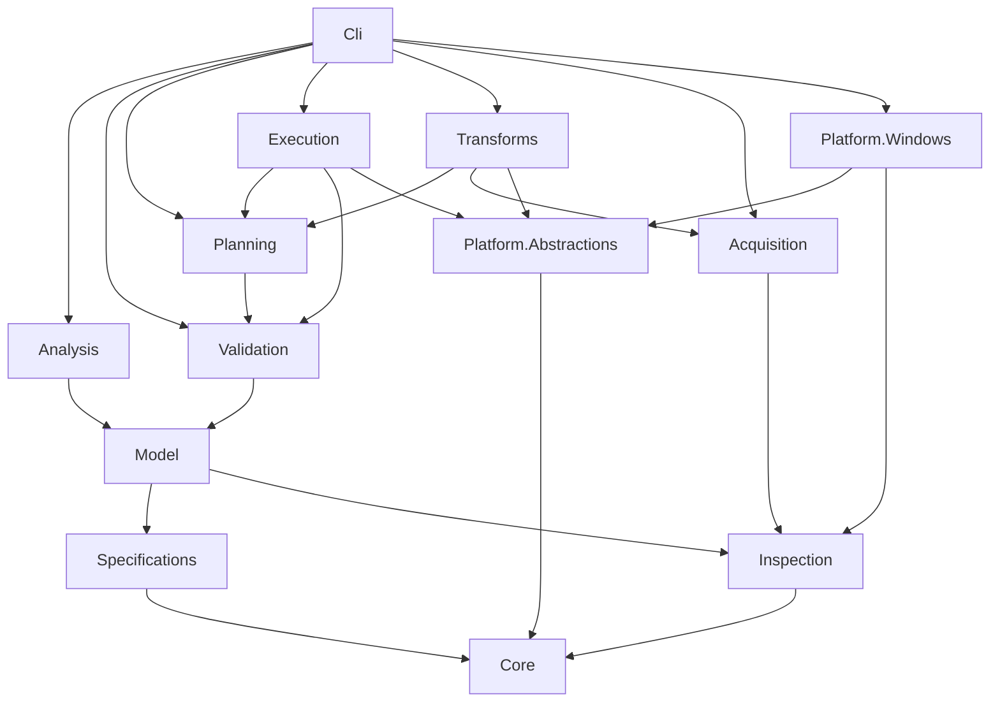
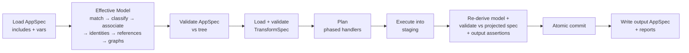

# Tailor Architecture

> Status: **Draft v0.1**. Items marked **Decided (provisional)** need confirmation before the dependent work unit (WU) starts. Implementation sequencing is in [Tailor.plan.md](../Plans/Tailor.plan.md).

## 1. Summary

Tailor is a binary-first .NET CLI tool. It analyses, validates and transforms compiled .NET application folder trees. It never modifies the input tree, and it produces a new tree plus a new Application Specification (AppSpec) ([RQ §1](../Requirements/Repackage_tool_Requirements_v1.1.md), [RQ §4](../Requirements/Repackage_tool_Requirements_v1.1.md)).

| Item | Value |
|---|---|
| Working names (placeholder, see [§20](#20-open-questions)) | Product `Tailor`, command `dotnet-tailor`, root namespace `Tailor`, package id `dotnet-tailor` |
| Tool runtime | `net10.0` (LTS), C#, packaged with `dotnet tool`, SemVer ([RQ §10](../Requirements/Repackage_tool_Requirements_v1.1.md), [RQ §11](../Requirements/Repackage_tool_Requirements_v1.1.md)) |
| Target runtimes | Configured independently of the tool runtime: `net8.0` and later |
| Platform v1 | Windows host, `win-x64` output. Linux and other RIDs are possible later through the platform abstraction ([AS §8.3](../Requirements/Application_Specification.md)) |
| Hosting | GitHub + GitHub Actions |
| Tests | xUnit v3 on Microsoft Testing Platform (MTP), in-repo golden-file helper (`tests/Tailor.Testing`, [§16](#16-testing-strategy)), sample apps built from source in the repo |

### 1.1 Source authority

| Abbrev. | Document | Authority |
|---|---|---|
| RQ | [Repackage_tool_Requirements_v1.1.md](../Requirements/Repackage_tool_Requirements_v1.1.md) | Authoritative |
| AS | [Application_Specification.md](../Requirements/Application_Specification.md) | Authoritative |
| TS | [Transformation_Specification.md](../Requirements/Transformation_Specification.md) | Authoritative |
| RD | [R2R_tool_Design.md](../Requirements/R2R_tool_Design.md) | Historical. Used only for details that the authoritative documents do not cover |
| CK | [Read_to_run_Cake.md](../Requirements/Read_to_run_Cake.md) | Historical. Used only for details that the authoritative documents do not cover |
| FS | [folderspec.json](../Requirements/folderspec.json) | Mock format only. Not an input format |

### 1.2 Non-goals (v1)

- Source builds, MSBuild or SDK targets, installers, Native AOT, IL rewriting, and running the application as a tool feature ([RQ §2.2](../Requirements/Repackage_tool_Requirements_v1.1.md), [CK §13](../Requirements/Read_to_run_Cake.md)).
- Single-file bundles as input. The tool detects them and refuses with diagnostic `TLR2xxx`.
- Multi-RID output, PGO and CPU-specific R2R. The design leaves room for them ([RD §12](../Requirements/R2R_tool_Design.md)).
- Authenticode re-signing (see [§20](#20-open-questions)).

## 2. Glossary

| Term | Meaning |
|---|---|
| AppSpec | Application Specification. Declarative, state-only, rule-based description of an app tree ([AS §1](../Requirements/Application_Specification.md)) |
| TransformSpec | Transformation Specification. Declarative intent ([TS §1](../Requirements/Transformation_Specification.md)) |
| Effective Application Model (EAM) | The fully resolved in-memory model built from AppSpec + tree: matched folders, classifications, associations, identities, graphs |
| Plan | Expanded, concrete, side-effect-free action list with provenance ([TS §31](../Requirements/Transformation_Specification.md)) |
| Derived artefact | Regenerable output that is not authoritative, e.g. an inventory or graph ([AS §22](../Requirements/Application_Specification.md)) |
| Sidecar | A tool-owned file inside the app folder (the AppSpec and `.tailor/`). Sidecars are automatically excluded from app scope |
| FD / SC | Framework-dependent / self-contained |
| WU | Work unit, an atomic agent task (see the plan) |

## 3. Solution Layout

The solution uses `.slnx`, Central Package Management (`Directory.Packages.props`), and `Directory.Build.props` with `Nullable=enable`, `TreatWarningsAsErrors=true`, `Deterministic=true`, and the .NET analyzers at the recommended level. `global.json` pins the net10 SDK and sets the MTP test runner.

```text
src/
  Tailor.Cli/                     System.CommandLine host, verbs, exit codes; PackAsTool
  Tailor.Core/                    RelativePath, Diagnostic, results, ordering, canonical JSON, hashing
  Tailor.Specifications/          AppSpec + TransformSpec models, serialisation, includes, variables, schemas
  Tailor.Inspection/              PE/metadata, runtimeconfig/deps.json readers, apphost binding reader, RID/culture
  Tailor.Model/                   Effective Application Model engine
  Tailor.Analysis/                Heuristic analyser -> draft AppSpec, capability assessment
  Tailor.Validation/              AppSpec-vs-tree and TransformSpec validation
  Tailor.Planning/                Selectors, precedence, planner pipeline, action model, projected AppSpec
  Tailor.Transforms/              ITransformationHandler implementations
  Tailor.Acquisition/             NuGet acquisition, version policies, cache, RuntimeList catalogue
  Tailor.Execution/               Staging, executor, symbols output, post-exec validation, reports
  Tailor.Platform.Abstractions/   IPlatformServices and related contracts
  Tailor.Platform.Windows/        Apphost patching, PE resources, subsystem
tests/
  Tailor.<Project>.Tests/         One xUnit v3 project per src project
  Tailor.IntegrationTests/        CLI + pipeline over the published test-app matrix
  Tailor.RegressionTests/         Golden-file regression over the matrix
  Tailor.Testing/                 Test-support class library (golden-file helper); referenced by test projects, not a test project
  TestApps/                             Source for the sample apps (see §16)
build/Build-TestApps.ps1                Publishes the matrix into artifacts/testapps (git-ignored) + manifest
schemas/{appspec,transformspec,plan}/v1/  Generated JSON Schemas, committed
Docs/{Requirements,Architecture,Plans,Specs,Spikes,Guides,Decisions}/
```

### 3.1 Project responsibilities and allowed dependencies



| Project | Owns | Must not |
|---|---|---|
| Core | `RelativePath` (always `/`, root-confined, ordinal-ignore-case comparison on Windows via a policy object), `Diagnostic` (`TLRnnnn`, severity, location, policy mapping), `Result<T>`, deterministic sort helpers, canonical JSON writer, SHA-256 content hashing, `TreeFingerprint`, `IPackageLocator` contract | Reference any other project |
| Specifications | Object models, System.Text.Json read (comments and trailing commas tolerated) and canonical write, `$schema`/`kind`/`schemaVersion`/`generator`, include resolution (cycle detection, precedence), variable resolution, schema generation (`JsonSchemaExporter`) and validation | Access the app tree |
| Inspection | `PEReader`/`MetadataReader` facts, runtimeconfig/deps.json reading (Microsoft.Extensions.DependencyModel), apphost binding read (single owner), RID graph and culture knowledge, `IFrameworkCatalogue` contract | Make classification decisions |
| Model | Folder matching, classification, associations, identities, reference resolution, dependency and plugin graphs, derived artefacts, deterministic deployment-model/framework/TFM detection primitives (`Model.Execution`) | Use heuristics (Analysis owns those) |
| Analysis | Heuristics that produce a draft AppSpec with confidence annotations; rule compaction; capability report | Be used by `validate`, `plan` or `apply` |
| Validation | AppSpec-vs-tree validation, TransformSpec schema, semantic and input-assertion validation | Mutate anything; reference Analysis |
| Planning | Selector engine, precedence and conflicts, phased planner, action model, collision and dependency-safety checks, projected AppSpec, output assertions | Perform filesystem writes; the only side effect it may request is declared acquisition |
| Transforms | Handlers per category (see [§9](#9-transformation-handlers)) | Execute actions directly |
| Acquisition | NuGet download and caching, generic version-range resolver, provenance, RuntimeList catalogue; implementations of `IFrameworkCatalogue` and `IPackageLocator` | Know about AppSpec semantics |
| Execution | Output safety, staging, action executors, symbols output, re-derivation and validation, atomic commit, reports | Change the plan |
| Platform.* | `IPlatformServices`: apphost create/patch (binding read reuses the Inspection reader), PE resource copy, subsystem, path canonicalisation (reparse points) | Leak Windows types into other projects |

Wiring: the Cli composes services with `Microsoft.Extensions.DependencyInjection`. Handlers are registered by category string, which keeps new categories extensible ([TS §7.2](../Requirements/Transformation_Specification.md), [TS §32.17](../Requirements/Transformation_Specification.md)).

### 3.2 Cross-layer contracts

Contracts live in the lowest project that needs them; implementations live higher up and are wired by the Cli. No project gains a reference that §3.1 forbids.

| Contract | Lives in | Implemented by | Consumers | Fallback when not wired |
|---|---|---|---|---|
| `IFrameworkCatalogue` | Inspection (WU-303) | Acquisition, RuntimeList-backed (WU-701) | Model reference resolution (WU-303) | `EmptyFrameworkCatalogue`: framework references become `framework-provided (unverified)` warnings |
| `IPackageLocator` | Core (WU-100) | Acquisition (WU-700) | Execution executors (WU-601, WU-703) | None; a package source without a locator is an execution error |
| `IConfigModifier` | Planning `Planning.Actions` (WU-503 defines, WU-601 consumes) | Transforms (WU-604 deps.json pruning, WU-801/802/803 config modifiers) | Execution `ModifyConfig` executor (WU-601) | None; an unknown modifier name is `TLR6103` |
| `IAcquisitionPlanner` | Planning (WU-503) | Transforms adapter over Acquisition (WU-702) | Planner phase 2 | `NoAcquisitionPlanner` (v0.2.0): any acquisition request is an error |
| `TreeFingerprint`, content hashing | Core (WU-100) | — | Model artefacts (WU-305 adds sidecar exclusion only), Validation, Execution | — |
| Apphost binding read (`ApphostBindingReader`) | Inspection (WU-202), single owner | — | Analysis (WU-400), Validation (WU-403), Transforms; `Platform.Windows` reuses it internally to verify hosts it creates or patches (WU-800). `IApphostService` has no read operation | — |
| Deployment-model / framework / TFM detection primitives | Model `Model.Execution` (WU-305) | — | Analysis (WU-400) adds confidence and heuristics; Validation (WU-403) compares declared vs detected. Validation never references Analysis | — |

The Cli registers the Acquisition-backed implementations from WU-704 onwards (first CLI end-to-end run that needs packages); before that the fallbacks above apply.

## 4. Processing Pipeline



| Verb | Stages | Mutates |
|---|---|---|
| `analyse` | Inspect → heuristics → draft AppSpec → EAM → self-validate → write AppSpec + derived artefacts | Writes sidecars only |
| `validate` | L → M → VA | Writes reports only |
| `plan` | L → … → P | Writes the plan and reports. Downloads packages to the cache unless `--offline` |
| `apply` | Full pipeline (`--dry-run` stops after P) | Writes the output directory |

**Model build order** ([AS §10](../Requirements/Application_Specification.md), [AS §11](../Requirements/Application_Specification.md), [AS §12](../Requirements/Application_Specification.md), [AS §15](../Requirements/Application_Specification.md), [AS §16](../Requirements/Application_Specification.md)): match folders → classify files → associate → inspect identities → resolve references → build graphs.

**Planner phases.** The phase order is fixed. Within a phase, the planner derives the order ([TS §23.3](../Requirements/Transformation_Specification.md), [RQ §6](../Requirements/Repackage_tool_Requirements_v1.1.md)):

| # | Phase | Main handlers |
|---|---|---|
| 1 | ResolveTargetState | All (resolve variables, TFM, RID, runtime version) |
| 2 | Acquisition | Acquisition requests from all handlers |
| 3 | Retarget | Retarget |
| 4 | Patch | Patch.Runtime, Patch.Library |
| 5 | DeploymentModel | DeploymentModel |
| 6 | FilteringLayout | Filtering, Layout, Symbols, Docs, Resources |
| 7 | Optimisation | Optimisation.ReadyToRun |
| 8 | ConfigGeneration | runtimeconfig/deps.json writers |
| 9 | ProjectedValidation | Projected AppSpec, output assertions, collisions, dependency safety |

The plan records the phase and order of every action. Planning is side-effect-free. The only exception is package-cache downloads, which appear as declared acquisition actions and are disabled by `--offline`.

## 5. Artefacts

Each artefact has a separate concern ([AS §22](../Requirements/Application_Specification.md), [TS §31](../Requirements/Transformation_Specification.md), [RQ §8](../Requirements/Repackage_tool_Requirements_v1.1.md)).

| Artefact | File pattern | Authoritative | Deterministic |
|---|---|---|---|
| AppSpec | `*.appspec.json` (default `tailor.appspec.json`) | Yes, once validated | Yes |
| TransformSpec | `*.transform.json` | Yes (intent) | Authored |
| Plan | `*.plan.json` | No | Yes |
| Derived analysis | `inventory.json`, `classification-map.json`, `assemblies.json`, `dependency-graph.json`, `plugin-graph.json`, `runtime-inventory.json`, `capabilities.json` | No | Yes |
| Validation report | `validation-report.json` (spec hash + tree fingerprint + state) | No | Yes |
| Execution report | `execution-report.json` (actual actions, tool outputs, timings) | No | Yes, except timings |
| Logs | `tailor.log` | No | No |

- Artefacts go to `--artefacts <dir>` (`--artifacts` remains a permanent alias). The default is `.tailor/` next to the AppSpec. **Decided (provisional).**
- Canonical JSON rules: UTF-8 without BOM, LF line endings (deliberate, see [§15](#15-determinism)), 2-space indentation, stable property order from the model, sorted collections, no timestamps. Informational timestamps ([AS §5.2](../Requirements/Application_Specification.md)) are never emitted in canonical artefacts.
- The validation state is a separate report, not embedded in the AppSpec (see [§19](#19-resolved--open-inconsistencies) item 1). States: `Unvalidated | Validated | ValidatedWithWarnings | Invalid` ([AS §20.2](../Requirements/Application_Specification.md)). `apply` always re-validates.

## 6. Specification Documents

### 6.1 Common rules

- The header contains `$schema`, `kind` (`AppSpec` | `TransformSpec` | `Plan`), `schemaVersion` (`major.minor`), and `generator` (`{tool, version}`, optional). The AppSpec and TransformSpec schema versions are independent. An unknown major version is rejected. A newer minor version is accepted with a warning only if every member is known ([AS §5](../Requirements/Application_Specification.md), [TS §5](../Requirements/Transformation_Specification.md)).
- JSON only for v1. **Decided (provisional).** Property names use camelCase.
- `includes[]` holds document paths relative to the **including file's directory** (`..` allowed; absolute paths and URLs rejected). Resolution is depth-first and ordered, with cycle detection (`TLR1xxx`, the error lists the cycle chain). Precedence: the including document overrides included documents, and later includes override earlier ones for keyed members only (by `id`). A duplicate `id` at the same precedence level is an error ([AS §21](../Requirements/Application_Specification.md), [TS §27](../Requirements/Transformation_Specification.md)).
- Schemas are generated from the models with `JsonSchemaExporter`, committed under `schemas/`, and checked in CI for drift. The validator library is decided by spike WU-007.

### 6.2 AppSpec shape (illustrative; the WU-101 schema is normative)

```jsonc
{
  "$schema": "<schema-uri>", "kind": "AppSpec", "schemaVersion": "1.0",
  "generator": { "tool": "dotnet-tailor", "version": "0.1.0" },
  "includes": ["shared/runtime-layout.appspec.json"],
  "application": { "id": "Contoso.Viewer", "version": "4.2.0",
    "entryPoints": [{ "host": "Viewer.exe", "assembly": "Viewer.dll", "subsystem": "gui" }] },
  "execution": { "deploymentModel": "frameworkDependent", "confidence": "derived" },
  "platform": { "rids": ["win-x64"] },
  "frameworkContexts": [{ "id": "main", "tfm": "net8.0-windows",
    "frameworks": [{ "name": "Microsoft.WindowsDesktop.App", "version": "8.0.13" }] }],
  "classifications": { "catchAll": "content", "groups": [
    { "id": "managed", "priority": 100, "match": { "glob": ["*.dll", "*.exe"], "is": "managed" } },
    { "id": "native",  "priority": 90,  "match": { "glob": ["*.dll", "*.exe"], "is": "native" } } ] },
  "associations": [{ "type": "symbols", "pattern": "{name}.pdb", "required": false }],
  "folders": {
    "definitions": [{ "id": "runtimes", "mask": "runtimes", "role": "runtime", "recurse": true }],
    "root": { "id": "root", "role": "applicationRoot",
      "references": ["current"], "duplicates": "error",
      "folders": [
        { "idRef": "runtimes" },
        { "id": "resources", "mask": "<culture>", "role": "resources" },
        { "id": "plugins", "mask": "Plugins/*", "role": "plugin", "references": ["current", "root"],
          "folders": [{ "idRef": "runtimes" }] },
        { "id": "other", "mask": "**", "role": "content", "recurse": true } ] } }
}
```

Capability assessment ([AS §19](../Requirements/Application_Specification.md)) is written only to `capabilities.json`. The AppSpec does not embed it (see [§19](#19-resolved--open-inconsistencies) item 17).

### 6.3 TransformSpec shape (illustrative; the WU-102 schema is normative)

```jsonc
{
  "$schema": "<schema-uri>", "kind": "TransformSpec", "schemaVersion": "1.0",
  "variables": { "targetTfm": { "default": "net10.0-windows" } },
  "input":  { "assert": { "deploymentModel": "frameworkDependent", "tfm": "net8.0*" } },
  "defaults": { "symbols": "preserve", "documentation": "preserve", "policies": { "optimisationFailure": "warning" } },
  "operations": {
    "retarget": { "tfm": "${targetTfm}" },
    "patch": { "runtime": { "version": "latestPatch" },
               "libraries": [{ "package": "Newtonsoft.Json", "allow": "patch" }] },
    "deploymentModel": { "target": "selfContained", "rid": "win-x64" },
    "optimisation": { "readyToRun": { "select": { "all": [ { "assemblyRole": ["application", "plugin"] },
                                                       { "not": { "name": "Legacy.*" } } ] } } } },
  "rules": [
    { "id": "no-xml-docs", "action": "exclude", "select": { "association": "xmlDoc" } },
    { "id": "english-only", "action": "exclude", "select": { "not": { "culture": ["en", "en-*"] }, "classification": "resource" } } ],
  "symbols": { "policy": "separate", "output": { "format": "zip" } },
  "output": { "assert": { "deploymentModel": "selfContained", "rid": "win-x64" } }
}
```

- No implicit runtime version: an operation that changes the runtime (FD→SC, SC→FD, retarget, runtime patch) needs an explicit version or runtime version policy (`matchSource`, `latestPatch`, `exact`, `range`) in the TransformSpec. A missing value is a validation error (see [§10](#10-acquisition)).
- Variables use `${name}` string substitution only. There is no expression language. Values come from the CLI `--var` option, then the document default. Any unresolved variable is an error before planning starts ([TS §28](../Requirements/Transformation_Specification.md)).
- Credentials are never in specs. Package sources are referenced by `nuget.config` source name or URL; credentials come only from the NuGet configuration hierarchy (see [§10](#10-acquisition)) ([TS §29](../Requirements/Transformation_Specification.md)).

## 7. Effective Application Model Semantics

### 7.1 Folder matching

Refs: [AS §10](../Requirements/Application_Specification.md), [RD §3](../Requirements/R2R_tool_Design.md).

- A mask is a glob (Microsoft.Extensions.FileSystemGlobbing semantics) plus two built-in tokens. `<culture>` matches a known culture name (from the .NET culture list plus pattern validation). `<rid>` matches a RID from the RID knowledge base.
- `**` matches **one or more** folder levels, never zero, so every `idRef` recursion step consumes at least one level. **Decided (provisional).**
- `recurse: true` applies the definition to all descendants that no child definition matches. Child definitions apply relative to the explicitly matched folder only; they do **not** implicitly re-apply below recursed folders. Use `idRef` to repeat a structure at deeper levels. **Decided (provisional).**
- `idRef` reuses a definition. Explicit members on the referencing node override the referenced definition. A self-reference through a nested child (recursive structure, e.g. plugins inside plugins) is allowed because it consumes one folder level per step. A pure alias cycle (`A → B → A` with no folder consumed) is an error (`TLR3xxx`).
- Sibling specificity: a segment ranks literal > single-segment wildcard or token (`*`, `?`, `<culture>`, `<rid>`) > `**`. A multi-segment mask ranks by its **least-specific segment**; ties are broken by segment count (more segments = more specific). Two or more equally ranked matches for one folder is an error. **Decided (provisional).**
- Paths are confined to the app root. The tool rejects absolute paths, `..`, and reparse points (symlinks or junctions) that resolve outside the root.
- Enumeration is sorted ordinal-ignore-case. Sidecars are excluded.

### 7.2 Classification ([AS §11](../Requirements/Application_Specification.md))

- A group is a set of matchers: a glob plus inspection predicates (`managed`, `native`, `mixed`, `r2r`, `satellite`, `referenceAssembly`). Each group has an explicit `priority`.
- Each file gets exactly one primary classification. When two groups tie on priority and both match, the result is an error. Every folder scope must have an effective catch-all (default `content`).
- Built-in group vocabulary: `managed`, `platformManaged`, `native`, `platformNative`, `config`, `resource`, `symbols`, `xmlDoc`, `content`. The vocabulary is extensible.

### 7.3 Associations ([AS §12](../Requirements/Application_Specification.md))

- Name rules: `{name}.pdb`, `{name}.xml`, `{file}.config`, `{name}.runtimeconfig.json`, `{name}.deps.json`, `<culture>/{name}.resources.dll`. Each rule is marked required or optional.
- A missing required association is an error. A missing optional association is informational.
- An associated file has its own primary classification and is linked to exactly one primary file.

### 7.4 Identities and inspection

| Fact | Source |
|---|---|
| Managed or not | `PEReader.PEHeaders.CorHeader != null` |
| Mixed-mode (R2R-ineligible) | No `ILOnly` flag |
| Architecture | `CoffHeader.Machine` + `CorFlags` (`Requires32Bit`, `Prefers32Bit`) |
| R2R / composite | `ManagedNativeHeaderDirectory` with `RTR` signature; composite component flags |
| Reference assembly | `ReferenceAssemblyAttribute` |
| TFM | `TargetFrameworkAttribute` |
| Satellite | Non-empty culture + `*.resources` name |
| Identity | Name, version, culture, public key token ([RD §5.2](../Requirements/R2R_tool_Design.md)) |
| Apphost binding | Patched DLL path in the apphost; bundle marker → refuse (single-file) |

### 7.5 Reference resolution ([AS §15](../Requirements/Application_Specification.md), [RD §5](../Requirements/R2R_tool_Design.md))

- Ordered roots per folder context: `current`, `parent`, `root`, `folder:<id>`, and root-relative paths. There is no implicit inheritance, no global probing, and no SDK fallback.
- The duplicate policy applies per context: `error | first | highestVersion`.
- Framework references resolve against a **framework catalogue** through `IFrameworkCatalogue` (Inspection, [§3.2](#32-cross-layer-contracts)): the runtime pack `RuntimeList.xml` when one is available (cached or `--offline`-available; implemented by Acquisition in WU-701). When no catalogue is wired or the pack is unavailable, the reference is marked `framework-provided (unverified)`, which produces a warning diagnostic.
- An unresolved non-framework reference is an error by default (see [§19](#19-resolved--open-inconsistencies) item 20).

### 7.6 Graphs ([AS §16](../Requirements/Application_Specification.md), [RD §6](../Requirements/R2R_tool_Design.md))

- The assembly dependency graph and the plugin graph are derived artefacts. The plugin graph must be a DAG. Cycles are found with Tarjan strongly connected components (SCC), and the diagnostic lists the plugin cycle path and the assembly references involved.

## 8. Selectors, Precedence and Actions

- Selector grammar: `all | any | not` plus semantic predicates (`folderId`, `folderRole`, `classification`, `association`, `assemblyRole`, `plugin`, `frameworkRole`, `rid`, `culture`, `tfm`, `name`) and physical globs (`path`) ([TS §8](../Requirements/Transformation_Specification.md)). An absent `select` means the whole app; the schema documents this explicitly.
- Precedence levels ([TS §22.2](../Requirements/Transformation_Specification.md)): 1 global default < 2 classification < 3 folder-semantic < 4 path/file < 5 explicit exception. Two incompatible rules at the same level for one artefact is an error. Document order never resolves conflicts ([TS §22.5](../Requirements/Transformation_Specification.md)).
- Actions ([TS §26.4](../Requirements/Transformation_Specification.md)): `Copy`, `Add`, `Remove`, `Replace`, `Move`, `ModifyConfig`, `Optimise`, `ExtractSymbols`, `Preserve`. Each action has an id, phase, source (input path, package `{id, version, sha512, path}`, or generated), destination, `dependsOn`, provenance (rule id, document, precedence level, handler), and expected hash where known.
- Planning checks: output path collisions ([TS §18.5](../Requirements/Transformation_Specification.md)), dependency safety of removals ([TS §20.3](../Requirements/Transformation_Specification.md)), explicit-upgrade enforcement ([TS §32.8](../Requirements/Transformation_Specification.md)), and at least one operation ([TS §32.2](../Requirements/Transformation_Specification.md)).
- Projected AppSpec: the planner derives the output AppSpec from the input AppSpec plus the actions, then validates it against a projected tree and the output assertions ([TS §25](../Requirements/Transformation_Specification.md)).

```csharp
public interface ITransformationHandler
{
    string Category { get; }          // e.g. "optimisation.readyToRun"
    PlanPhase Phase { get; }
    IEnumerable<Diagnostic> Validate(HandlerContext context);
    ValueTask ContributeAsync(PlanBuilder plan, HandlerContext context, CancellationToken ct);
}
```

## 9. Transformation Handlers

| Handler | Key behaviour | Refs |
|---|---|---|
| Filtering / Layout | Include/exclude by selector. Preserve by default. Output path mapping by folder semantics. Collision detection | [TS §9](../Requirements/Transformation_Specification.md), [TS §18](../Requirements/Transformation_Specification.md) |
| Symbols | `preserve` / `exclude` / `separate`. The separate output is a directory or a deterministic zip (sorted entries, fixed timestamps, no path traversal) | [TS §16](../Requirements/Transformation_Specification.md), [CK §8.3](../Requirements/Read_to_run_Cake.md) |
| Docs | `preserve` / `exclude` via the `xmlDoc` association | [TS §17](../Requirements/Transformation_Specification.md) |
| Resources | Culture selectors (`en`, `en-*`). Respects associations | [TS §15](../Requirements/Transformation_Specification.md) |
| Retarget | Updates runtimeconfig (`tfm`, framework versions), deps.json `runtimeTarget`, and framework assembly replacement (SC). Compatibility analysis scans `MemberRef`/`TypeRef` against the target runtime pack (e.g. BinaryFormatter removal) and fails planning unless a compatibility policy allows it | [TS §11](../Requirements/Transformation_Specification.md), [CK §9.2](../Requirements/Read_to_run_Cake.md) |
| Patch.Runtime | SC: replaces runtime pack files by `RuntimeList.xml` diff (managed + native). FD: raises the runtimeconfig framework version. Invalidates `--inputbubble`/composite R2R output that includes the framework | [TS §12.2](../Requirements/Transformation_Specification.md), [CK §9.1](../Requirements/Read_to_run_Cake.md) |
| Patch.Library | Explicit package selection, library version policy (`exact`, `patch`, `minor`, `range`; a separate type from runtime version policies, see §10), deps.json update, no transitive upgrade unless listed | [TS §12.3](../Requirements/Transformation_Specification.md), [TS §12.5](../Requirements/Transformation_Specification.md) |
| DeploymentModel | Requires an explicit target runtime version or policy (§6.3, §10). FD→SC: adds runtime pack(s) (NETCore + WindowsDesktop/AspNetCore as referenced, filtered by `Profile` WPF/WindowsForms), `hostfxr`/`hostpolicy`, runtimeconfig `includedFrameworks`, deps.json `runtimeTarget` `/win-x64` + `runtimepack.*` libraries, re-patched apphost. SC→FD: reverse, removing only files listed in the RuntimeList catalogue | [TS §13](../Requirements/Transformation_Specification.md), [CK §5](../Requirements/Read_to_run_Cake.md) |
| Optimisation.ReadyToRun | Eligibility (`Planned`, `Skipped(reason)`, `Ineligible(reason)`), compilation units, crossgen2 invocation | [TS §14](../Requirements/Transformation_Specification.md), [RD §8](../Requirements/R2R_tool_Design.md) |

### 9.1 ReadyToRun details

- Crossgen2 package: `Microsoft.NETCore.App.Crossgen2.<hostRid>`, taken from `tools/`. The tool detects `crossgen2.exe` (single-file, .NET 8+) or `crossgen2.dll` and does not assume either. The crossgen2 major version equals the **target** runtime major version.
- References are always implementation assemblies from the target runtime pack, including for FD apps. App and plugin references come from the EAM closure. Plugins never require co-compilation ([RD §8.3](../Requirements/R2R_tool_Design.md)).
- Arguments go in `.rsp` files: inputs, `-o`, `-r`, `--targetos:windows`, `--targetarch:x64`, `-O`, optional `--pdb`, `-m`/`--embed-pgo-data`, `--parallelism`, `--resilient`. `--composite` and `--inputbubble` are allowed for SC only and never include framework assemblies in v1. The process starts with `ArgumentList` (never a shell).
- Framework assemblies from runtime packs are **not recompiled in v1** (they ship R2R already), even when a selector matches them explicitly (warning, then skipped).
- Skipped reasons: already R2R, framework assembly from a runtime pack, not selected. Ineligible reasons: mixed-mode, reference assembly, satellite resource assembly, composite component, architecture mismatch. Stripping existing R2R is future work.
- Determinism across two runs is verified by spike WU-004 and asserted in M7.

### 9.2 Apphost

- Package: `Microsoft.NETCore.App.Host.win-x64`. The same `apphost.exe` serves FD and SC; SC is determined by `hostfxr.dll` in the app folder plus runtimeconfig `includedFrameworks`.
- The tool uses its own minimal patcher in `Platform.Windows`: it replaces the SHA-256("foobar") placeholder with the relative DLL path, handles the .NET 9+ `DOTNET_ROOT` search placeholder, sets the PE subsystem to `WINDOWS_GUI` for GUI entry points, and copies Win32 resources (icon, version, manifest) from the original host. Microsoft.NET.HostModel is not used (it is not a supported nuget.org API).
- Binding read has a single owner: `ApphostBindingReader` in Inspection (WU-202). `IApphostService` (WU-800) only creates and patches hosts; `Platform.Windows` reuses the reader internally to verify its output.
- Modifying the apphost invalidates any Authenticode signature. The tool emits a warning (`TLR8xxx`); re-signing is out of scope.

## 10. Acquisition

- Built on NuGet.Protocol and NuGet.Configuration. It honours the standard `nuget.config` hierarchy exactly as NuGet does, including `packageSourceCredentials`, credential providers and package source mapping. Packages go to the global packages folder. Credentials are never accepted in the TransformSpec, CLI or tool config, and never stored, logged or written to artefacts.
- Version resolution: Acquisition exposes one generic resolver, NuGet `VersionRange` → highest stable version in range (prerelease only when the range names one). It is resolved at plan time and pinned in the plan ([TS §29.3](../Requirements/Transformation_Specification.md)).
- Runtime version policies and library version policies are separate types (Specifications, WU-102). Each type maps itself onto a NuGet range string (pure semantic-version arithmetic, no NuGet dependency in Specifications); Transforms parse the string and call the Acquisition resolver:

| Policy | Kind | Range |
|---|---|---|
| `exact v` | runtime, library | `[v]` |
| `latestPatch` | runtime | `[M.m.0, M.(m+1).0)`, `M.m` = target runtime major.minor |
| `matchSource` | runtime | `[source runtime version]` |
| `range r` | runtime, library | `r` |
| `patch` | library | `[current, M.(m+1).0)` |
| `minor` | library | `[current, (M+1).0.0)` |

- No implicit runtime version: FD→SC, SC→FD, retarget and runtime patch require an explicit runtime version or policy; a missing one is a validation error. Tool packages (crossgen2, host pack) follow the resolved target runtime version (tool-internal `matchTarget`, not a TransformSpec policy).
- Provenance recorded per package: `{id, version, source, sha512}`. The downloaded package hash is checked against `.nupkg.metadata`/`sha512`.
- `--offline` resolves from the cache only. A miss produces exit code 4.
- The RuntimeList catalogue parses `data/RuntimeList.xml` (`Type`, `AssemblyVersion`, `FileVersion`, `Culture`, `Profile`). It is the authoritative file list for framework ownership, patch diffs and SC→FD removal.

## 11. Execution and Safety

- Input/output rules ([RQ §9](../Requirements/Repackage_tool_Requirements_v1.1.md), [TS §24.4](../Requirements/Transformation_Specification.md)): paths are canonicalised with symlinks and junctions resolved. Input ≠ output, and neither may be nested inside the other. The output must be absent or empty. Violations are unconditional structural errors (exit code 1), detected before any write.
- Staging: the tool writes to a sibling `<output>.staging-<random>` directory, runs post-execution re-derivation, validation and output assertions there, then renames atomically (`Directory.Move` on the same volume). On failure (executor fault, post-validation or output-assertion failure, commit failure) it deletes staging and returns exit code 5. On cancellation (Ctrl+C) it deletes staging and returns exit code 130. No partial output remains.
- Post-execution: the tool rebuilds the EAM from the staged tree with the projected AppSpec, compares it to the projection, and checks output assertions ([TS §25.4](../Requirements/Transformation_Specification.md)).
- Output AppSpec: written to `<output>/tailor.appspec.json` (sidecar) unless `--spec-out` is given.
- Long paths (>260 characters) are supported through `\\?\`-safe APIs and are covered by tests.

## 12. Platform Abstraction

`IPlatformServices` exposes `IApphostService` (create, patch/rebind, detect bundle; binding reads use the Inspection reader, [§3.2](#32-cross-layer-contracts)), `IPeResourceService`, `IPathCanonicaliser`, and `IPlatformKnowledge` (default RID, host RID, executable naming). v1 registers only `Platform.Windows`. RIDs, OS and path policy are never hard-coded outside the platform projects and `Inspection` RID knowledge ([RQ §11](../Requirements/Repackage_tool_Requirements_v1.1.md)).

## 13. Diagnostics, Failure Policy and Exit Codes

- Code ranges: `TLR0xxx` CLI/config, `1xxx` spec loading/schema, `2xxx` inspection, `3xxx` model, `4xxx` validation/analysis, `5xxx` planning/selectors, `6xxx` execution/safety, `7xxx` acquisition/R2R, `8xxx` deployment/apphost, `9xxx` retarget/patch. The full catalogue is in `Docs/Guides` (WU-1001).
- A diagnostic carries a code, severity, message, location (spec document + JSON pointer, and/or relative path), and related locations.
- Policy: per-condition policies in the TransformSpec (`error | warning | skip | preserve`) ([TS §24](../Requirements/Transformation_Specification.md)) combined with one global mode:
  - Default: warnings never fail the run.
  - `--strict`: warnings count as errors, exit code 3.
  - `--permissive`: warnings never fail the run, and policy-configurable conditions ([TS §24.2](../Requirements/Transformation_Specification.md)) are downgraded to warnings. Unconditional structural errors ([TS §24.4](../Requirements/Transformation_Specification.md)) are unaffected.
- Diagnostic descriptors declare `IsStructural` and `IsPolicyConfigurable` (WU-100), so the mode rules are evaluated in one place (`PolicyEvaluator`).

| Exit | Meaning |
|---|---|
| 0 | Success |
| 1 | Validation, structural or dependency errors, including input/output path violations |
| 2 | Usage or invalid arguments |
| 3 | Warnings treated as errors (`--strict`) |
| 4 | Environment, tooling or acquisition failure |
| 5 | Execution failure, including output-assertion or post-validation failure after execution (output rolled back) |
| 70 | Internal error; also returned by verbs that are not implemented yet (stubs, `TLR0100`) |
| 130 | Cancelled (Ctrl+C); output rolled back |

## 14. CLI

The CLI follows dotnet conventions and uses Australian spelling for canonical repository-owned names. Where a name has a differing American spelling, that spelling is registered as a permanent alias ([RQ §10](../Requirements/Repackage_tool_Requirements_v1.1.md), [naming plan](../Plans/Tailor-naming.plan.md)).

| Verb | Synopsis |
|---|---|
| `analyse` | `dotnet-tailor analyse <appDir> [--spec-out <file>]` |
| `validate` | `dotnet-tailor validate <appDir> --spec <file>` |
| `plan` | `dotnet-tailor plan <appDir> --spec <file> --transform <file> [--out-plan <file>]` |
| `apply` | `dotnet-tailor apply <appDir> --spec <file> --transform <file> --output <dir> [--dry-run] [--spec-out <file>] [--symbols-output <path>]` |
| `inspect` | `dotnet-tailor inspect <appDir> --spec <file> [inventory\|classification\|assemblies\|graph\|plugins\|runtime] [--plugin <id>]` |
| `schema export` | `dotnet-tailor schema export [appspec\|transformspec\|plan] [--output <dir>]` |

- Global options: `--verbosity`, `--strict`/`--permissive`, `--artefacts <dir>` (with `--artifacts` alias), `--offline`, `--var name=value`, and `@file` response files (built into System.CommandLine).
- `analyze` is a permanent alias for canonical `analyse`; `--version` reports the packaged tool version.
- Verbs that are declared but not implemented yet return exit code 70 with `TLR0100`.
- Tool config file (M10, WU-1000): `dotnet-tailor.json`. Precedence ([CK §3.2](../Requirements/Read_to_run_Cake.md)):
  1. CLI arguments, with `@file` response files expanded inline (same layer, token order applies).
  2. Environment variables (`DOTNET_TAILOR_*`).
  3. Repo config: the first `dotnet-tailor.json` found from the current directory upwards; discovery stops at the git root.
  4. User config (`%APPDATA%\dotnet-tailor\dotnet-tailor.json` via `IPlatformKnowledge`).
  5. Built-in defaults.
- The historical `tool plugin <command>` namespace ([RD §10](../Requirements/R2R_tool_Design.md)) is dropped. Plugin scoping uses selectors and `inspect --plugin`.

## 15. Determinism

- Enumeration is sorted ordinal-ignore-case. Dictionaries are serialised sorted, and JSON is canonical.
- There are no timestamps, machine paths or GUIDs in canonical artefacts. The tree fingerprint is a hash over the sorted `(relativePath, size, sha256)` entries.
- External inputs (package versions and hashes, crossgen2 version) are pinned in the plan. Equal inputs plus an equal environment produce byte-identical plans and artefacts ([TS §3.6](../Requirements/Transformation_Specification.md), [CK §4.3](../Requirements/Read_to_run_Cake.md)).
- Line endings of tool-generated artefacts (AppSpec and TransformSpec canonical writes, plans, reports, derived artefacts) are always LF with a fixed canonical form, independent of host OS and git settings. This keeps bytes and hashes identical across machines and platforms; Windows tooling (VS, VS Code, Notepad, PowerShell) reads LF JSON fine. **Decided (provisional)**, [§19](#19-resolved--open-inconsistencies) item 38.
- Repository source files are the opposite: CRLF in the working tree (Windows-first), LF in the git index. `.gitattributes` forces `eol=crlf` per source extension so checkout is CRLF regardless of `core.autocrlf`, keeping `dotnet format` and byte-level diffs consistent on every machine and CI runner. Exceptions forced to LF: `*.sh`, golden files under `tests/**/Golden/**`, and committed tool-generated files (`schemas/**`, `Docs/Guides/diagnostics.md`), which must byte-match canonical tool output. `.editorconfig` mirrors this (`end_of_line = crlf` at root; `lf` for `[*.sh]`, `[tests/**/Golden/**]`, `[schemas/**]` and `[Docs/Guides/diagnostics.md]`). Delivered by WU-000.

## 16. Testing Strategy

- Unit tests: one xUnit v3 project per src project. Golden files are used for models, plans and artefacts.
- Golden-file helper (`tests/Tailor.Testing`, class library; project delivered by WU-000, helper by WU-100): `Golden.AssertMatches(string actual, string name, [CallerFilePath] string callerPath = "")`. Golden files live next to the test class under `Golden/<TestClass>/<name>.golden.json` (or `.golden.txt`) and are committed, always LF. Comparison is ordinal text equality after applying only test-supplied scrubbers (e.g. temp paths → `{TEMP}`, repo root → `{REPO}`). On mismatch the actual output is written to `<name>.received.json` (git-ignored) and the assertion message shows a unified diff summary. `DOTNET_TAILOR_UPDATE_GOLDEN=1` overwrites golden files instead of failing; it is never set in CI, and CI asserts it is unset. No third-party snapshot library ([§19](#19-resolved--open-inconsistencies) item 37).
- Test apps (`tests/TestApps/`): console, WinForms, WPF, a plugin host with a one-way plugin chain, a deliberately cyclic plugin variant, satellite resources, native DLLs, a multi-RID `runtimes/` folder, and mixed-mode (C++/CLI, optional).
- Matrix built by `build/Build-TestApps.ps1`: `{net8.0, net10.0} × {FD, SC} × {R2R off, on}`. Output goes to `artifacts/testapps/` with `manifest.json`. CI caches it, keyed on the TestApps source hash and SDK version.
- Integration and regression tests: CLI end-to-end over the matrix, dry-run no-mutation enforcement (filesystem snapshot before and after), determinism (two runs, byte comparison), and launch smoke tests for outputs. Launch smoke tests are test-harness only, not a tool feature ([RQ §2.2](../Requirements/Repackage_tool_Requirements_v1.1.md)).
- Matrix fixtures flagged `expectedInvalid` in `manifest.json` (e.g. the cyclic plugin app) are excluded from "zero errors" checks and must instead produce their listed diagnostics.
- Conventions: every test carries `[Trait("WU", "<id>")]`. Run one WU with `dotnet test --project <test project path> --filter-trait "WU=<id>"` (MTP mode, no `--` separator). `Category` traits (combinable): `Integration` (cross-project in-process pipeline/CLI tests), `Matrix` (needs `artifacts/testapps`; skips with a reason locally when absent, never in CI), `Network` (external feeds; skipped unless `DOTNET_TAILOR_TEST_NETWORK=1`, run nightly), `Launch` (starts produced apps). The default run makes no network calls.
- Naming: standard .NET naming, no underscores. Test classes are `<TypeUnderTest>Tests`; test methods are PascalCase `<Subject><Condition><ExpectedResult>`, e.g. `ReferencedAssemblyLoads`, `ParseRejectsAbsolutePath`, `ClassifyReturnsCatchAllForUnknownFile`. CA1707 is not suppressed.

## 17. Security

- Untrusted binaries: parsed only through `System.Reflection.Metadata` with bounds-checked readers. Malformed PE files produce diagnostics and never crash the tool.
- Paths: all spec paths go through `RelativePath` confinement. Zip writing uses validated relative entry names.
- Processes: crossgen2 runs with `ArgumentList` and `.rsp` files, from a package path verified by hash. There is no shell execution.
- Secrets: credentials come only from NuGet configuration and credential providers. They are never logged or written to artefacts.

## 18. Repository AI Enablement

`AGENTS.md`, `.github/copilot-instructions.md`, `.github/instructions/*.instructions.md` (C#, tests, specs/docs), `.github/prompts/` (`plan-work`, `new-work-unit-spec`, `implement-work-unit`, `review-changes`, `address-review`, `verify-work-unit`), `.github/skills/` (`work-unit-workflow`, `planning-artifacts`, `code-review`, `test-evidence`, `devops-pipelines`, `schema-change`, `test-apps`), and `.github/agents/` (contributor, planner, implementer, code-reviewer, reviewer/verifier, probe, research). Delivered by WU-001.

## 19. Resolved / Open Inconsistencies

| # | Conflict | Decision | Rationale | Status |
|---|---|---|---|---|
| 1 | [AS §20](../Requirements/Application_Specification.md) validation state inside the spec vs state-only / history-free ([AS §1](../Requirements/Application_Specification.md), [RQ §8](../Requirements/Repackage_tool_Requirements_v1.1.md)) | Separate validation report (spec hash + tree fingerprint). `apply` always re-validates | A self-attested flag goes stale after edits ([AS §20.4](../Requirements/Application_Specification.md)) | Provisional, confirm |
| 2 | [RQ §9](../Requirements/Repackage_tool_Requirements_v1.1.md) / [AS §23.1](../Requirements/Application_Specification.md) default AppSpec in the app folder vs "analysis never modifies input" ([RQ §4.1](../Requirements/Repackage_tool_Requirements_v1.1.md)) | AppSpec and `.tailor/` are sidecars, auto-excluded from scope. Written to the app folder only if it is writable, otherwise `--spec-out` is required | App files are never modified; sidecars do not change app state | Provisional, confirm |
| 3 | [RD §7.2](../Requirements/R2R_tool_Design.md) metadata `transformations[]`/`diagnostics[]` | Superseded by the plan and report artefacts | [TS §31](../Requirements/Transformation_Specification.md) | Decided |
| 4 | [CK §7.3](../Requirements/Read_to_run_Cake.md) English-only and [CK §6.2](../Requirements/Read_to_run_Cake.md)/[§7.1](../Requirements/Read_to_run_Cake.md) other-RID removal as mandatory | Preserve by default. Shipped template `enterprise-win-x64.transform.json` (WU-1003) | [TS §9.5](../Requirements/Transformation_Specification.md), [TS §21.4](../Requirements/Transformation_Specification.md) | Decided |
| 5 | [FS](../Requirements/folderspec.json) `other` `**` overlapping siblings vs "no ambiguous matches" ([RD §3.4](../Requirements/R2R_tool_Design.md)) | Sibling specificity precedence ([§7.1](#71-folder-matching)) | Keeps the catch-all concise | Decided |
| 6 | Config and response file ([CK §3.2](../Requirements/Read_to_run_Cake.md)) absent from RQ | Keep both: response files early, config file in M10 | CI ergonomics | Decided |
| 7 | [CK §12](../Requirements/Read_to_run_Cake.md) fail-fast / warn-and-continue vs [TS §24](../Requirements/Transformation_Specification.md) policies | Global `--strict`/`--permissive` + per-condition policies | One consistent model | Decided |
| 8 | [RD §10](../Requirements/R2R_tool_Design.md) `tool plugin` namespace | Dropped. Selectors + `inspect --plugin` instead | Plugins are selectors in TS | Decided |
| 9 | [RQ §6](../Requirements/Repackage_tool_Requirements_v1.1.md) fixed ordering vs [TS §23](../Requirements/Transformation_Specification.md) planner-derived ordering | Fixed phase sequence, planner-derived order within each phase, recorded in the plan | Satisfies both | Decided |
| 10 | FD framework references vs "no SDK fallback" ([RD §5.3](../Requirements/R2R_tool_Design.md)) | Framework catalogue from RuntimeList, else "unverified" warning | Deterministic, no global probing | Decided |
| 11 | Linux / future RIDs | Abstraction only in v1 | [RQ §11](../Requirements/Repackage_tool_Requirements_v1.1.md) | Decided |
| 12 | [RD §1.3](../Requirements/R2R_tool_Design.md) "documented SDK behaviour only" vs a custom apphost patcher (undocumented placeholder format, HostModel unsupported) | Accept. Isolated in `Platform.Windows`, verified per runtime major by spike WU-005 and tests | No supported alternative exists | **Open, confirm** |
| 13 | [CK §2.3](../Requirements/Read_to_run_Cake.md) "SDK installed, `dotnet` on PATH" vs NuGet-acquired crossgen2 and packs | No SDK required at run time. Only the tool's own .NET runtime is needed | Reproducible, version-pinned tooling | Provisional |
| 14 | [CK §6.2](../Requirements/Read_to_run_Cake.md) / [RD §1.1](../Requirements/R2R_tool_Design.md) R2R mandatory vs [RQ §1](../Requirements/Repackage_tool_Requirements_v1.1.md) optional | R2R is an optional operation | RQ is authoritative | Decided |
| 15 | [CK §2.2](../Requirements/Read_to_run_Cake.md) WCF in scope, ASP.NET out of scope vs AspNetCore runtime pack support | The tool does not restrict app types. AspNetCore shared framework is supported in the catalogue and FD⇄SC. Test apps cover console/WinForms/WPF only | Framework handling is generic | **Open, confirm test scope** |
| 16 | [RQ §4.3](../Requirements/Repackage_tool_Requirements_v1.1.md) / [TS §32.2](../Requirements/Transformation_Specification.md) "at least one material transformation" vs v0.2.0 filtering-only releases | Filtering, layout, symbols, docs and resources count as material packaging operations ([RQ §5.3](../Requirements/Repackage_tool_Requirements_v1.1.md)). An empty `operations` + `rules` set is an error | Enables incremental delivery | Provisional |
| 17 | [AS §1](../Requirements/Application_Specification.md) lists "capabilities" in the AppSpec vs [AS §19.3](../Requirements/Application_Specification.md)/[§22](../Requirements/Application_Specification.md) derived, advisory | Capabilities only in `capabilities.json` | Derived, non-authoritative | Provisional |
| 18 | [TS §33](../Requirements/Transformation_Specification.md) "latest permitted runtime patch" vs determinism / `--offline` | Resolved at plan time and pinned in the plan. `--offline` uses the latest cached version and warns | [TS §29.3](../Requirements/Transformation_Specification.md) | Provisional |
| 19 | [FS](../Requirements/folderspec.json) `id_ref: plugins` inside `plugins` vs "no circular id_ref chains" ([RD §3.4](../Requirements/R2R_tool_Design.md)); FS `<lang_spec>`, `\` separators, boolean `duplicate_references`, snake_case | Recursive nesting allowed, alias cycles are errors. Canonical `<culture>`, `/`, policy enum, camelCase. FS is not accepted as input | FS is a mock | Provisional |
| 20 | [RD §5.3](../Requirements/R2R_tool_Design.md) "missing references are structural errors" vs real apps with never-loaded optional references | Error by default. The AppSpec may declare `knownUnresolved` references (a state fact), which downgrades them to a warning | Keeps the state/intent split | **Open, confirm** |
| 21 | [RQ §2.2](../Requirements/Repackage_tool_Requirements_v1.1.md) no runtime execution vs milestone launch smoke tests | Launching happens only in the test harness | Tool scope unchanged | Decided |
| 22 | [AS §5.2](../Requirements/Application_Specification.md) optional creation timestamps vs byte-identical artefacts | Never emitted in canonical artefacts. Timings appear only in the execution report | Determinism | Provisional |
| 23 | §6.1 "root-relative" include paths vs WU-103 resolution relative to the including file | Include paths are relative to the including file ([§6.1](#61-common-rules)) | Shared documents can include their own neighbours | Decided |
| 24 | Contract ownership across layers (framework catalogue, package locator, fingerprint, apphost binding read, FD/SC/TFM detection) | Table in [§3.2](#32-cross-layer-contracts) | Keeps §3.1 reference rules intact | Decided |
| 25 | `**` zero-level matches, multi-segment mask ranking, child definitions below recursed folders | `**` = one or more levels; rank by least-specific segment, then segment count; no implicit re-application below recursed folders ([§7.1](#71-folder-matching)) | Terminating `idRef` recursion, predictable ranking | Provisional |
| 26 | Undefined exit codes for cancellation, post-execution assertion failure, path violations, stub verbs | 130 cancelled; 5 output-assertion failure after execution; 1 path violations; 70 stubs ([§13](#13-diagnostics-failure-policy-and-exit-codes)) | Conventional codes; path violations are structural ([TS §24.4](../Requirements/Transformation_Specification.md)) | Decided |
| 27 | `--permissive` semantics undefined | Warnings never fail; [TS §24.2](../Requirements/Transformation_Specification.md) policy-configurable conditions become warnings; [TS §24.4](../Requirements/Transformation_Specification.md) structural errors unaffected ([§13](#13-diagnostics-failure-policy-and-exit-codes)) | Mirrors the TransformSpec policy model | Decided |
| 28 | M5 "zero mutations outside `--artefacts`" vs plan-time package downloads (§4) | Zero mutations outside `--artefacts` and the NuGet package cache; the cache only when not `--offline` | Acquisition is the only declared side effect | Decided |
| 29 | Credentials limited to env/credential providers (WU-700) vs "honours `nuget.config`" (§10) | Standard NuGet hierarchy exactly as NuGet does, incl. `packageSourceCredentials` and credential providers; never in specs, CLI or tool config ([§10](#10-acquisition)) | Behaves like `dotnet restore` | Decided |
| 30 | Inconsistent test commands and categories across specs | `dotnet test --project <path> --filter-trait "WU=<id>"`; categories `Integration`/`Matrix`/`Network`/`Launch`; default run has no network ([§16](#16-testing-strategy)) | One convention for agents and CI | Decided |
| 31 | Tool config name, response-file layer, repo vs user config, discovery boundary | `dotnet-tailor.json`; CLI (response files inline) > env > repo (stop at git root) > user > defaults ([§14](#14-cli)) | Response files are CLI input; git root bounds discovery | Decided |
| 32 | Recompiling runtime-pack framework assemblies; satellites missing from §9.1 skip list | Framework assemblies are not recompiled in v1; satellite resource assemblies are ineligible ([§9.1](#91-readytorun-details)) | Runtime packs ship R2R | Decided |
| 33 | Default runtime version for FD→SC/SC→FD/retarget when none is stated | No implicit choice; explicit version or policy (`matchSource`, `latestPatch`, `exact`, `range`) required, else validation error ([§10](#10-acquisition)) | Explicit intent ([TS §21.4](../Requirements/Transformation_Specification.md)) | Decided |
| 34 | M4 "zero errors across the matrix" vs the deliberately cyclic plugin app | Fixtures flagged `expectedInvalid` in the manifest are excluded and must produce their expected diagnostics ([§16](#16-testing-strategy)) | Negative fixtures stay in the matrix | Decided |
| 35 | SDK-equivalence of converted runtimeconfig/deps.json vs RID-specific asset flattening in SDK SC publishes | Documented normalisation (RID-specific package asset flattening, property ordering) defined in WU-805 | Tool preserves assets by default (item 4) | Decided |
| 36 | Runtime (`matchTarget`, …) and library (`patch`, `minor`, …) version policies mixed in one type | Separate types; Acquisition exposes one generic range resolver both map onto ([§10](#10-acquisition)) | Different semantics, one resolution mechanism | Decided |
| 37 | Snapshot testing library | Snapshot testing library deferred; in-repo golden-file helper used ([§16](#16-testing-strategy)). Alternatives considered: Verify (licence/sponsorship check SC021 required), Shouldly `ShouldMatchApproved` (MIT, approval-file style), Snapshooter (MIT, JSON snapshots), ApprovalTests.Net (Apache-2.0, less active). May be revisited | No licence or sponsorship dependency; canonical JSON already gives stable text | Decided (provisional) |
| 38 | Windows-first repository (CRLF working tree) vs byte-stable generated artefacts | Tool-generated artefacts are always LF in a fixed canonical form; repo sources are CRLF in the working tree; golden files and `*.sh` are LF ([§15](#15-determinism)) | Byte-level determinism and hashing across machines/platforms; Windows tools handle LF JSON | Decided (provisional) — revisit if users need CRLF output; would be a single canonical-writer setting |

## 20. Open Questions

Awaiting user decision (provisional defaults apply until decided):

| Question | Provisional default |
|---|---|
| Final product name, tool command, root namespace and NuGet package id | Working names in [§1](#1-summary) |
| Licence | Placeholder LICENSE; nuget.org publishing blocked until set |
| `knownUnresolved` references in the AppSpec (item 20) | Implement as specified; mark dependent ACs `Blocked (#20)` if rejected |
| Own apphost patcher relying on the undocumented placeholder format (item 12) | Accept, isolated in `Platform.Windows`, per-major tests |
| WCF / ASP.NET / AspNetCore runtime pack scope (item 15) | AspNetCore handled generically; test apps cover console/WinForms/WPF only |
| Authenticode re-signing | Warn only in v1 |
| May `--output` pre-exist (`--force`)? | No: absent or empty only |
| AppSpec format | JSON only |

Owned by work units or deferred:

- JSON Schema validator library (JsonSchema.Net licence vs Corvus.JsonSchema vs NJsonSchema). Decided by WU-007.
- Snapshot testing library: deferred; in-repo golden-file helper used ([§19](#19-resolved--open-inconsistencies) item 37). Alternatives: Verify (SC021 licence/sponsorship check required), Shouldly `ShouldMatchApproved`, Snapshooter, ApprovalTests.Net. May be revisited.
- **Resolved** — committed tool-generated files are LF-exempt like golden files: `.gitattributes` adds `schemas/** text eol=lf` and `Docs/Guides/diagnostics.md text eol=lf`; `.editorconfig` mirrors them. Drift tests stay byte-wise. Any future committed generated file gets the same exception (WU-000 D4).
- `$schema` URI hosting (repo raw URL vs versioned docs site).
- Should `apply --plan <file>` replay a pinned plan exactly (stronger reproducibility, [TS §3.6](../Requirements/Transformation_Specification.md))? Not in v1 scope.
- Default artefacts location for `apply` when the AppSpec lives in the read-only input: provisional `<output>.tailor/` sibling of the output.

## 21. Spikes Feeding This Document

| Spike | Question | Output |
|---|---|---|
| WU-004 | crossgen2 package layout (8/10), `.rsp` baselines from SDK publishes, version compatibility, determinism | `Docs/Spikes/`, ADR |
| WU-005 | Apphost patching, bundle detection, FD⇄SC via runtimeconfig/deps.json, launch | `Docs/Spikes/`, ADR |
| WU-006 | RuntimeList diff 8.0.13 / 8.0.25 / 10.0.x, WPF/WinForms `Profile` | `Docs/Spikes/`, ADR |
| WU-007 | NuGet.Protocol acquisition with `nuget.config` and auth, schema validator choice and licence | `Docs/Spikes/`, ADR |

ADRs are stored in `Docs/Decisions/ADR-NNNN-<slug>.md`. Spike outcomes update this document.
