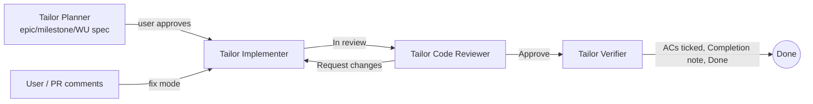

# AI Contribution Workflow

This guide covers the agents, skills and prompts for contributing to .NET Tailor. Rules live in [AGENTS.md](../../AGENTS.md), sequencing in [the plan](../Plans/Tailor.plan.md), and the WU contract in its spec. The agents link to these sources rather than copying them.

## Flow

Start with **Tailor Contributor**, which routes each task to one of six lanes: plan, implement, devops, docs, review and fix. You can also invoke an agent or prompt directly.

## Levels and gates

Epic → Feature → Work unit → Step, with milestones grouping features for release. Each level has acceptance criteria tagged with a verification method (`T`/`I`/`A`/`D`), and `(T)` criteria are linked to tests by `[Trait("AC", "<artifact>/<ID>")]`. Gates G1–G8 (epic ready → milestone released) and templates are in the [`planning-artifacts` skill](../../.github/skills/planning-artifacts/SKILL.md). Implementers never tick their own steps or criteria; the Verifier does.

## Repo agents (`.github/agents/`)

| Agent | Does | Edits |
|---|---|---|
| Tailor Contributor | Routes lanes and handoffs; small doc edits | Docs only when needed |
| Tailor Planner | Epics, features, milestones, WU specs and steps, ADRs; gates G1–G4 | `Docs/{Epics,Features,Plans,Specs,Decisions,Spikes}` |
| Tailor Implementer | Implements a WU's steps (code, tests, CI, docs); fix mode for review findings | WU scope |
| Tailor Code Reviewer | Read-only review; verdict `Approve` or `Request changes` | None |
| Tailor Verifier | Ticks proven steps and criteria; Completion notes; `Done` for WU, and feature/epic when complete | Specs, features, epics, plan status |
| Tailor Probe | Behaviour checks with evidence (subagent only) | Scratch or test files |

## Skills and prompts

- Skills (`.github/skills/`): `work-unit-workflow`, `planning-artifacts`, `code-review`, `test-evidence`, `devops-pipelines`, `schema-change`, `test-apps`.
- Prompts (`/` commands): `plan-work`, `new-work-unit-spec`, `implement-work-unit`, `review-changes`, `address-review`, `verify-work-unit`.

## Review feedback

Agent reviews use `CR-n` IDs, and GitHub PR comments use `PR-n`. The Implementer answers each finding with a resolution table (`code-review` skill). Agents never post PR comments or push without approval. They also never merge.

## Optional local dependencies

When one of these is missing, the repo agents carry on without it.

| Used by | Asset | Type | Source (marketplace / id) | Version |
|---|---|---|---|---|
| Contributor, Code Reviewer | `SE: Security`, `SE: DevOps/CI`, `SE: Tech Writer` | Agents | awesome-copilot ([github/awesome-copilot](https://github.com/github/awesome-copilot)) / `software-engineering-team` plugin | 1.0.0 |
| Contributor, Planner | `Research` | Agent | User-level custom agent (`~/.copilot/agents/research.agent.md`) | unversioned |
| Contributor (docs lane) | `docs-sync-audit`, `documentation-writer` | Skills | User-level skills (`~/.agents/skills/`); upstream not recorded | unversioned |
| Contributor (commit) | `git-commit` | Skill | User-level skill (`~/.agents/skills/`); upstream not recorded | unversioned |

The `test-evidence` skill and the Probe agent are vendored into the repo, so contributors need no local copies.
