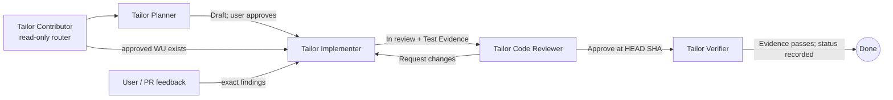

# AI Contribution Workflow

Use this guide for agent roles and handoffs. [AGENTS.md](../../AGENTS.md) owns repository conventions, [the master plan](../Plans/Tailor.plan.md) owns WU sequencing and status, and each WU spec owns scope and acceptance criteria. Keep those sources authoritative; link to them rather than copying their rules.

## Standard flow

Start with **Tailor Contributor** unless the task clearly targets a specific agent or prompt. The Contributor only reads enough to route work; it does not edit, run checks or update status. A review `Approve` is not completion: explicitly hand off to the Verifier, who checks evidence and only then records status. If the reviewed SHA or evidence is stale, the Verifier reports the blocker and leaves the WU incomplete.

## Lanes

| Request | Route | Boundary |
|---|---|---|
| Epic, feature, milestone, WU, ADR or spike | Tailor Planner | Planning artefacts only; new work stops at `Draft` until user approval. |
| Approved WU implementation or fix | Tailor Implementer | WU scope only; dependencies must be `Done`; no ticking steps/ACs or setting `Done`. |
| CI, nightly, Dependabot, packaging or release change | Planner if no approved spec; otherwise Implementer | WU must name `devops-pipelines`; optional DevOps review does not replace code review. |
| Planning-doc change | Tailor Planner | Planning artefacts only. |
| Docs owned by a WU | Tailor Implementer | Included in that WU's scope and review. |
| Standalone docs edit | `SE: Tech Writer` if available | If unavailable, report the missing editor and ask the user how to proceed; Contributor does not edit. |
| Staleness audit | `docs-sync-audit` if installed | Read-only findings; do not edit unless separately requested and routed. |
| Branch, PR or diff review | Tailor Code Reviewer | Read-only; returns findings and `Approve` or `Request changes` at a specific HEAD. |
| Verification after approval | Tailor Verifier | Checks the exact WU, evidence and reviewed HEAD; only this role records verified completion. |

## Handoffs and evidence

- Delegate only a distinct, bounded task. Do not delegate simple lookups or split one continuous investigation across agents.
- Each handoff states the goal, exact WU/spec or target paths, allowed edits, required inherited evidence, expected result and stop condition. Pass only necessary context; do not ask another agent to repeat completed work.
- The receiving agent returns changed paths (if any), checks and exact results, status changes, blockers and the next handoff. Report observed status only; do not speculate or narrate deliberation.
- Any agent that plans, runs, delegates, receives or verifies tests or probes loads the [`test-evidence` skill](../../.github/skills/test-evidence/SKILL.md). Pass inherited Test Evidence records verbatim; summaries do not replace them. Reuse only exact matching state and environment.
- Keep research, probes and security reviews bounded to the assigned question. Probe answers one behaviour question; Research reports sourced options; neither takes over implementation.

## Instructions, skills and prompts

- Start with [`AGENTS.md`](../../AGENTS.md) and `.github/copilot-instructions.md`; applicable `.github/instructions/*.instructions.md` add scoped conventions.
- Load the matching skill for the task. The WU, planning, architecture-change, review, DevOps, schema and test-app skills define their respective procedures; [`test-evidence`](../../.github/skills/test-evidence/SKILL.md) is required whenever tests or probes are planned, run, delegated, received or verified.
- Prompts in `.github/prompts/` route planning, spec creation, implementation, review, fixes and verification to the corresponding repo agent. They do not override the plan, spec or agent permissions.

## Roles and edit rights

| Agent | Purpose | May edit |
|---|---|---|
| Tailor Contributor (`contributor.agent.md`) | Read-only router and handoff coordinator | None |
| Tailor Planner (`planner.agent.md`) | Plan and gate planning artefacts | `Docs/Epics`, `Features`, `Plans`, `Specs`, `Decisions`, `Spikes` |
| Tailor Implementer (`implementer.agent.md`) | Implement one approved WU or resolve its review findings | Files in the agreed WU scope; never verification status |
| Tailor Code Reviewer (`code-reviewer.agent.md`) | Read-only review | None |
| Tailor Verifier (`verifier.agent.md`) | Verify exact evidence and record completion | Selected WU spec, its parent feature/epic and necessary master-plan status/criteria |
| Tailor Probe (`probe.agent.md`) | Answer one behaviour question with evidence | Scratch or test files only; no production code |
| Tailor Research (`research.agent.md`) | Provide sourced options for one decision | None |

## Planning and review gates

Epic → Feature → Work unit → Step, with milestones grouping features for release. Criteria use verification methods (`T`/`I`/`A`/`D`); each `(T)` criterion links to tests using `[Trait("AC", "<artifact>/<ID>")]`. See the [`planning-artifacts` skill](../../.github/skills/planning-artifacts/SKILL.md) for gates G1–G8 and templates. Only the Verifier ticks proven steps and criteria.

Agent reviews use stable `CR-n` IDs; GitHub PR comments use `PR-n`. The Implementer returns a resolution table for every finding; the Code Reviewer re-checks affected findings. Agents do not post PR comments, push or merge without user approval.

## Optional local dependencies

Optional external agents or skills improve specific lanes but never replace repo-agent responsibilities. If one is unavailable, follow the fallback above or report the limitation; do not silently skip a required gate.

| Used by | Optional asset |
|---|---|
| Contributor / Code Reviewer | `SE: Security`, `SE: DevOps/CI`, `SE: Tech Writer` |
| Contributor (staleness audit) | `docs-sync-audit` |
| Contributor (standalone docs) | `SE: Tech Writer` |

Repo-local skills, agents and prompts are in `.github/skills/`, `.github/agents/` and `.github/prompts/`.
