# Tailor Master Plan

> Status: **Draft v0.1**. Architecture: [Tailor.architecture.md](../Architecture/Tailor.architecture.md). Requirements: [RQ v1.1](../Requirements/Repackage_tool_Requirements_v1.1.md), [AS](../Requirements/Application_Specification.md), [TS](../Requirements/Transformation_Specification.md).

## Goal

Deliver `dotnet-tailor` v1.0.0. The tool analyses, validates and transforms compiled .NET application trees on Windows `win-x64`. It supports filtering and layout, ReadyToRun, FD⇄SC conversion, retargeting and patching. Work is split into atomic, independently verifiable work units (WUs), grouped into milestones M0–M10 that end in preview releases.

## How Agents Use This Plan

1. Select a `Ready` WU with all dependencies `Done`; prefer the [critical path](#critical-path).
2. Read `../Specs/<Milestone>/<ID>-<slug>.spec.md` and cited architecture/requirements. If missing, create it with `new-work-unit-spec` and have it reviewed.
3. Set `In progress`; use branch `wu/<id>-<slug>`.
4. Use `implement-work-unit`; satisfy the spec with focused tests and reviewable commits, then set `In review`.
5. Open a PR titled `WU-<id>: <title>`; require green CI and approval via `review-changes` and any human review.
6. The Verifier (`verify-work-unit`) checks and ticks proven criteria, adds a Completion note, sets `Done`, and ticks met milestone criteria.
7. For design changes, record an ADR in `Docs/Decisions/` and update the architecture in the same PR.

Statuses: `Draft` · `Ready` · `In progress` · `In review` · `Done` · `Blocked (<reason>)` · `Superseded`. Epics, features, steps, criteria and phase gates: `planning-artifacts` skill.

A milestone is a release grouping, not a start gate. A WU may start as soon as its dependencies are `Done`.

## Test Conventions

- Every test carries `[Trait("WU", "<id>")]`. Run one WU with `dotnet test --project <test project path> --filter-trait "WU=<id>"` (MTP mode, no `--` separator). Full suite: `dotnet test --solution DotNetTailor.slnx -c Release`.
- `Category` traits (combinable): `Integration` (cross-project in-process pipeline/CLI tests), `Matrix` (needs `artifacts/testapps`; skips with an explicit reason locally when absent, never skips in CI), `Network` (external feeds; skipped unless `DOTNET_TAILOR_TEST_NETWORK=1`, run nightly), `Launch` (starts produced apps in the harness).
- The default run (local and PR CI) makes no network calls.
- Naming: test classes `<TypeUnderTest>Tests`; methods PascalCase `<Subject><Condition><ExpectedResult>` with no underscores (e.g. `ParseRejectsAbsolutePath`); CA1707 is not suppressed.
- Expected outputs are golden files (`Golden/<TestClass>/<name>.golden.json`, LF) compared through the in-repo `Golden` helper in `tests/Tailor.Testing` ([architecture §16](../Architecture/Tailor.architecture.md#16-testing-strategy)).
- "Zero errors across the matrix" never includes fixtures flagged `expectedInvalid` in `manifest.json`; those must produce their listed diagnostics instead ([architecture §16](../Architecture/Tailor.architecture.md#16-testing-strategy)).

## Work Unit Status

| ID | Title | MS | Depends on | Parallel with | Spec | Status |
|---|---|---|---|---|---|---|
| WU-000 | repository-scaffold | M0 | — | — | [spec](../Specs/M0/WU-000-repository-scaffold.spec.md) | Done |
| WU-001 | ai-enablement | M0 | WU-000 | WU-002, WU-003, WU-006, WU-007, WU-100 | [spec](../Specs/M0/WU-001-ai-enablement.spec.md) | Done |
| WU-002 | ci-pipeline | M0 | WU-000 | WU-001, WU-003, WU-006, WU-007, WU-100 | [spec](../Specs/M0/WU-002-ci-pipeline.spec.md) | Ready |
| WU-003 | test-app-suite | M0 | WU-000 | WU-001, WU-002, WU-006, WU-007, WU-100 | [spec](../Specs/M0/WU-003-test-app-suite.spec.md) | Ready |
| WU-004 | spike-crossgen2 | M0 | WU-003 | WU-005, WU-006, WU-007, M1, M2 | [spec](../Specs/M0/WU-004-spike-crossgen2.spec.md) | Ready |
| WU-005 | spike-apphost-deployment-model | M0 | WU-003, WU-006 | WU-004, WU-007, M1, WU-200, WU-201, WU-203 | [spec](../Specs/M0/WU-005-spike-apphost-deployment-model.spec.md) | Ready |
| WU-006 | spike-runtime-packs | M0 | WU-000 | WU-001–WU-004, WU-007, WU-100 | [spec](../Specs/M0/WU-006-spike-runtime-packs.spec.md) | Ready |
| WU-007 | spike-nuget-and-libraries | M0 | WU-000 | WU-001–WU-006, WU-100 | [spec](../Specs/M0/WU-007-spike-nuget-and-libraries.spec.md) | Ready |
| WU-100 | core-primitives | M1 | WU-000 | WU-001–WU-007 | [spec](../Specs/M1/WU-100-core-primitives.spec.md) | Ready |
| WU-101 | appspec-model-and-schema | M1 | WU-100, WU-007 | WU-102, WU-105, M2 | [spec](../Specs/M1/WU-101-appspec-model-and-schema.spec.md) | Ready |
| WU-102 | transformspec-model-and-schema | M1 | WU-100, WU-007 | WU-101, WU-105, M2 | [spec](../Specs/M1/WU-102-transformspec-model-and-schema.spec.md) | Ready |
| WU-103 | multi-document-loader | M1 | WU-101, WU-102 | WU-105, M2, WU-300 | [spec](../Specs/M1/WU-103-multi-document-loader.spec.md) | Ready |
| WU-104 | transformspec-variables | M1 | WU-102, WU-103 | WU-105, M2, M3 | [spec](../Specs/M1/WU-104-transformspec-variables.spec.md) | Ready |
| WU-105 | cli-skeleton | M1 | WU-100 (`schema export` after WU-101, WU-102) | WU-101–WU-104, M2 | [spec](../Specs/M1/WU-105-cli-skeleton.spec.md) | Ready |
| WU-200 | pe-inspector | M2 | WU-100 | WU-201–WU-203, M1 | [spec](../Specs/M2/WU-200-pe-inspector.spec.md) | Ready |
| WU-201 | managed-metadata-reader | M2 | WU-100 | WU-200, WU-202, WU-203, M1 | [spec](../Specs/M2/WU-201-managed-metadata-reader.spec.md) | Ready |
| WU-202 | runtime-config-readers | M2 | WU-100, WU-005 | WU-200, WU-201, WU-203, M1 | [spec](../Specs/M2/WU-202-runtime-config-readers.spec.md) | Ready |
| WU-203 | rid-and-culture-knowledge | M2 | WU-100 | WU-200–WU-202, M1 | [spec](../Specs/M2/WU-203-rid-and-culture-knowledge.spec.md) | Ready |
| WU-300 | folder-matching-engine | M3 | WU-101, WU-203 | WU-200–WU-202, WU-103 | [spec](../Specs/M3/WU-300-folder-matching-engine.spec.md) | Ready |
| WU-301 | file-classification-engine | M3 | WU-300, WU-200 | WU-201, WU-202, WU-600 | [spec](../Specs/M3/WU-301-file-classification-engine.spec.md) | Ready |
| WU-302 | association-engine | M3 | WU-301 | WU-303, WU-304 | [spec](../Specs/M3/WU-302-association-engine.spec.md) | Ready |
| WU-303 | reference-resolution | M3 | WU-301, WU-201 | WU-302 | [spec](../Specs/M3/WU-303-reference-resolution.spec.md) | Ready |
| WU-304 | dependency-and-plugin-graphs | M3 | WU-303 | WU-302 | [spec](../Specs/M3/WU-304-dependency-and-plugin-graphs.spec.md) | Ready |
| WU-305 | derived-artefact-writers | M3 | WU-302, WU-304, WU-202 | WU-600, WU-700, WU-801 | [spec](../Specs/M3/WU-305-derived-artefact-writers.spec.md) | Ready |
| WU-400 | execution-model-analysis | M4 | WU-202, WU-305 | WU-403, WU-500 | [spec](../Specs/M4/WU-400-execution-model-analysis.spec.md) | Ready |
| WU-401 | folder-role-heuristics-and-rule-compaction | M4 | WU-400 | WU-402, WU-403, WU-500, WU-501 | [spec](../Specs/M4/WU-401-folder-role-heuristics-and-rule-compaction.spec.md) | Ready |
| WU-402 | capability-assessment | M4 | WU-400 | WU-401, WU-403, WU-500, WU-501 | [spec](../Specs/M4/WU-402-capability-assessment.spec.md) | Ready |
| WU-403 | appspec-validation-engine | M4 | WU-305, WU-202 | WU-400–WU-402, WU-500, WU-501 | [spec](../Specs/M4/WU-403-appspec-validation-engine.spec.md) | Ready |
| WU-404 | cli-analyse-validate | M4 | WU-401, WU-402, WU-403, WU-105, WU-103 | WU-502, WU-503 | [spec](../Specs/M4/WU-404-cli-analyse-validate.spec.md) | Ready |
| WU-405 | regression-harness | M4 | WU-404, WU-003, WU-002 | WU-406, M5, WU-1002 | [spec](../Specs/M4/WU-405-regression-harness.spec.md) | Ready |
| WU-406 | cli-inspect | M4 | WU-404, WU-305 | WU-405, M5, WU-1002 | [spec](../Specs/M4/WU-406-cli-inspect.spec.md) | Ready |
| WU-500 | selector-engine | M5 | WU-305, WU-102 | WU-400–WU-403 | [spec](../Specs/M5/WU-500-selector-engine.spec.md) | Ready |
| WU-501 | rule-precedence-and-conflicts | M5 | WU-500 | WU-400–WU-403 | [spec](../Specs/M5/WU-501-rule-precedence-and-conflicts.spec.md) | Ready |
| WU-502 | transformspec-validation | M5 | WU-501, WU-403, WU-104 | WU-404, WU-405 | [spec](../Specs/M5/WU-502-transformspec-validation.spec.md) | Ready |
| WU-503 | planner-core | M5 | WU-502 | WU-404, WU-405 | [spec](../Specs/M5/WU-503-planner-core.spec.md) | Ready |
| WU-504 | filtering-symbols-resources-layout-handlers | M5 | WU-503 | WU-507, WU-601, WU-702 | [spec](../Specs/M5/WU-504-filtering-symbols-resources-layout-handlers.spec.md) | Ready |
| WU-505 | projected-appspec-and-output-assertions | M5 | WU-503, WU-504 | WU-507, WU-601, WU-702 | [spec](../Specs/M5/WU-505-projected-appspec-and-output-assertions.spec.md) | Ready |
| WU-506 | plan-artefacts-and-cli-plan | M5 | WU-504, WU-505, WU-404, WU-507 | WU-602, WU-604 | [spec](../Specs/M5/WU-506-plan-artefacts-and-cli-plan.spec.md) | Ready |
| WU-507 | additions-handler | M5 | WU-503 | WU-504, WU-505, WU-601, WU-702 | [spec](../Specs/M5/WU-507-additions-handler.spec.md) | Ready |
| WU-600 | output-safety-and-staging | M6 | WU-100 | M2–M5 | [spec](../Specs/M6/WU-600-output-safety-and-staging.spec.md) | Ready |
| WU-601 | action-executor-and-symbols-output | M6 | WU-600, WU-503 | WU-504, WU-505, WU-507 | [spec](../Specs/M6/WU-601-action-executor-and-symbols-output.spec.md) | Ready |
| WU-602 | post-execution-validation | M6 | WU-601, WU-505 | WU-506, WU-604 | [spec](../Specs/M6/WU-602-post-execution-validation.spec.md) | Ready |
| WU-603 | cli-apply-and-e2e | M6 | WU-602, WU-506, WU-405, WU-604 | WU-702, WU-703 | [spec](../Specs/M6/WU-603-cli-apply-and-e2e.spec.md) | Ready |
| WU-604 | depsjson-asset-pruning | M6 | WU-202, WU-601 | WU-505, WU-506, WU-602, WU-702 | [spec](../Specs/M6/WU-604-depsjson-asset-pruning.spec.md) | Ready |
| WU-700 | nuget-acquisition-service | M7 | WU-007, WU-100 | M2–M6 | [spec](../Specs/M7/WU-700-nuget-acquisition-service.spec.md) | Ready |
| WU-701 | runtime-pack-catalogue | M7 | WU-700, WU-006 | M3–M6 | [spec](../Specs/M7/WU-701-runtime-pack-catalogue.spec.md) | Ready |
| WU-702 | r2r-eligibility-planner | M7 | WU-503, WU-200, WU-701 | WU-504, WU-505, M6 | [spec](../Specs/M7/WU-702-r2r-eligibility-planner.spec.md) | Ready |
| WU-703 | crossgen2-invoker | M7 | WU-702, WU-004 | M6, M8 | [spec](../Specs/M7/WU-703-crossgen2-invoker.spec.md) | Ready |
| WU-704 | r2r-e2e | M7 | WU-703, WU-603 | M8 | [spec](../Specs/M7/WU-704-r2r-e2e.spec.md) | Ready |
| WU-800 | apphost-service | M8 | WU-005, WU-700 | M3–M7 | [spec](../Specs/M8/WU-800-apphost-service.spec.md) | Ready |
| WU-801 | runtimeconfig-transformer | M8 | WU-202, WU-003 | M3–M7 | [spec](../Specs/M8/WU-801-runtimeconfig-transformer.spec.md) | Ready |
| WU-802 | depsjson-transformer | M8 | WU-202, WU-701, WU-003, WU-604 | WU-603, M7, WU-800, WU-801 | [spec](../Specs/M8/WU-802-depsjson-transformer.spec.md) | Ready |
| WU-803 | fd-to-sc-handler | M8 | WU-800, WU-801, WU-802, WU-503 | WU-603, M7 | [spec](../Specs/M8/WU-803-fd-to-sc-handler.spec.md) | Ready |
| WU-804 | sc-to-fd-handler | M8 | WU-801, WU-802, WU-503, WU-803 | WU-603, M7 | [spec](../Specs/M8/WU-804-sc-to-fd-handler.spec.md) | Ready |
| WU-805 | deployment-model-e2e | M8 | WU-803, WU-804, WU-603 | WU-704, WU-900–WU-902 | [spec](../Specs/M8/WU-805-deployment-model-e2e.spec.md) | Ready |
| WU-900 | runtime-patching | M9 | WU-803, WU-702, WU-703 | WU-901, WU-902, WU-805 | [spec](../Specs/M9/WU-900-runtime-patching.spec.md) | Ready |
| WU-901 | tfm-retargeting-and-compat-analysis | M9 | WU-801, WU-802, WU-701, WU-503, WU-201, WU-800, WU-702 | WU-703, WU-704, WU-803–WU-805, WU-900, WU-902 | [spec](../Specs/M9/WU-901-tfm-retargeting-and-compat-analysis.spec.md) | Ready |
| WU-902 | library-patching | M9 | WU-700, WU-802, WU-503, WU-305 | WU-603, M7, WU-803–WU-805, WU-900, WU-901 | [spec](../Specs/M9/WU-902-library-patching.spec.md) | Ready |
| WU-903 | combined-transform-e2e | M9 | WU-900, WU-901, WU-902, WU-704 | WU-1000–WU-1002 | [spec](../Specs/M9/WU-903-combined-transform-e2e.spec.md) | Ready |
| WU-1000 | tool-config-and-precedence | M10 | WU-105 | M2–M9 | [spec](../Specs/M10/WU-1000-tool-config-and-precedence.spec.md) | Ready |
| WU-1001 | diagnostics-catalogue | M10 | WU-603 | M7–M9 | [spec](../Specs/M10/WU-1001-diagnostics-catalogue.spec.md) | Ready |
| WU-1002 | packaging-and-release-workflow (**Scheduled: immediately after WU-404, enables v0.1.0-preview**) | M10 | WU-002, WU-404 | WU-405, WU-406, M5–M9 | [spec](../Specs/M10/WU-1002-packaging-and-release-workflow.spec.md) | Ready |
| WU-1003 | user-guides-and-templates | M10 | WU-903, WU-1000, WU-1001 | WU-1004 | [spec](../Specs/M10/WU-1003-user-guides-and-templates.spec.md) | Ready |
| WU-1004 | performance-and-determinism-hardening | M10 | WU-903 | WU-1003 | [spec](../Specs/M10/WU-1004-performance-and-determinism-hardening.spec.md) | Ready |

## Milestones

Dashed nodes are dependencies from other milestones.

### M0 Foundation & Repo Bootstrap

- **WU-000** scaffold: git init, root build/config files, net10 SDK + MTP runner, `DotNetTailor.slnx` with the [§3 project layout](../Architecture/Tailor.architecture.md#3-solution-layout) including `tests/Tailor.Testing`, README, CONTRIBUTING and Apache-2.0 LICENSE. Line endings follow [§15](../Architecture/Tailor.architecture.md#15-determinism).
- **WU-001** AI enablement: `AGENTS.md`, `.github/copilot-instructions.md`, scoped instructions (C#, tests, specs/docs), prompts (`plan-work`, `new-work-unit-spec`, `implement-work-unit`, `review-changes`, `address-review`, `verify-work-unit`), skills (`work-unit-workflow`, `planning-artifacts`, `code-review`, `test-evidence`, `devops-pipelines`, `schema-change`, `test-apps`), and repo agents (contributor, planner, implementer, code-reviewer, reviewer/verifier, probe, research).
- **WU-002** CI: GitHub Actions on `windows-latest` running build, test (MTP, TRX upload) and `dotnet format --verify-no-changes`. Dependabot for NuGet and Actions.
- **WU-003** Test apps: sources under `tests/TestApps/` + `build/Build-TestApps.ps1` publishing the matrix `{net8.0, net10.0} × {FD, SC} × {R2R off, on}` into `artifacts/testapps/` with `manifest.json`. CI cache.
- **WU-004–WU-007** Spikes: report in `Docs/Spikes/`, ADR in `Docs/Decisions/`, architecture updated.

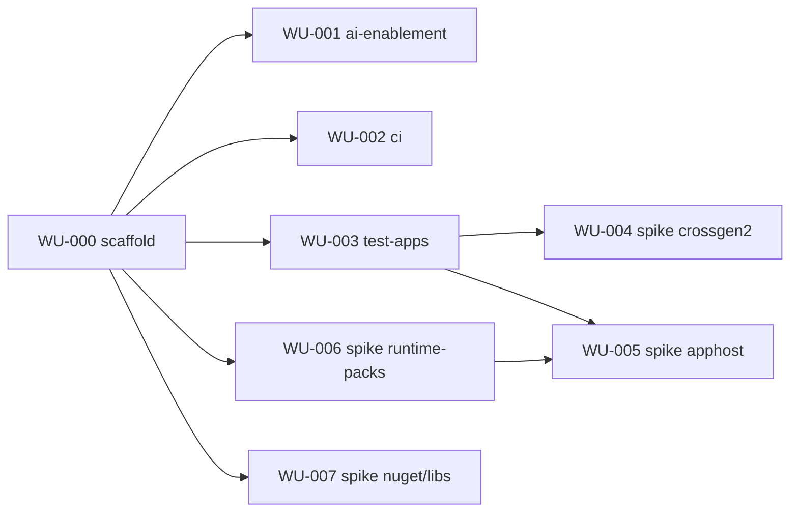

**M0 acceptance criteria**
- [ ] CI is green on `main` for the empty solution (build, test, format) on `windows-latest`.
- [ ] `Build-TestApps.ps1` publishes the full matrix. Running it twice produces the same `manifest.json` (file lists and hashes, excluding known non-deterministic files, which are listed).
- [ ] CI restores the matrix from cache when the TestApps sources are unchanged.
- [ ] Four spike reports exist in `Docs/Spikes/`, each with a recommendation, and each decision is recorded as an ADR and reflected in the architecture document.
- [x] AI enablement files exist, and the `implement-work-unit` prompt references this plan and the spec path convention.

### M1 Core Primitives & Specification Documents

- **WU-100** `RelativePath`, `Diagnostic`/codes, results, ordering, canonical JSON writer, hashing, `TreeFingerprint`, `IPackageLocator` contract, `Golden` test helper.
- **WU-101/102** Object models, (de)serialisation, generated schemas under `schemas/`, schema drift test.
- **WU-103** Includes with precedence and cycle detection ([AS §21](../Requirements/Application_Specification.md), [TS §27](../Requirements/Transformation_Specification.md)).
- **WU-104** `${var}` resolution and `--var` ([TS §28](../Requirements/Transformation_Specification.md)).
- **WU-105** System.CommandLine host, global options, exit codes, response files, `schema export`.

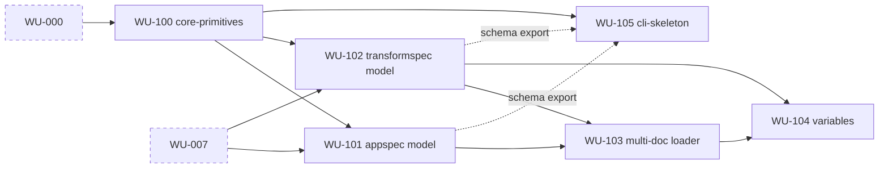

**M1 acceptance criteria**
- [ ] AppSpec and TransformSpec round-trip (read → canonical write → read) is lossless over a golden-file corpus. Canonical output is byte-stable.
- [ ] Committed schemas equal the generated ones (CI test). Invalid documents yield `TLR1xxx` with a JSON pointer.
- [ ] Include cycles and unresolved variables are reported as errors naming the chain or variable. Include paths resolve relative to the including file.
- [ ] `dotnet-tailor --help`, `schema export` and `@file` response files work. Exit code 2 is returned on invalid arguments; stub verbs return 70; cancellation returns 130.

### M2 Binary Inspection

- **WU-200** PE facts: managed, mixed, architecture, R2R/composite, bundle marker. **WU-201** identity, references, `TargetFramework`, `ReferenceAssembly`, satellite detection, MemberRef scan API. **WU-202** runtimeconfig, deps.json and apphost binding readers (single owner of the binding read; needs the WU-005 algorithm). **WU-203** RID graph and culture knowledge.

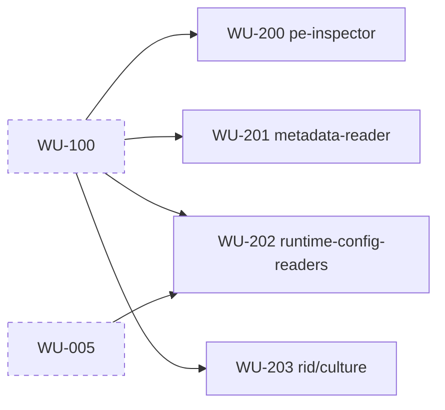

**M2 acceptance criteria**
- [ ] Inspection of every matrix binary matches a committed golden file: managed, native, mixed, R2R, satellite and reference assemblies are all classified correctly.
- [ ] Malformed or truncated PE fixtures produce diagnostics without exceptions.
- [ ] A single-file bundle fixture is detected and reported.
- [ ] Apphost binding (DLL path) is read correctly for net8 and net10 FD and SC apphosts.

### M3 Effective Application Model

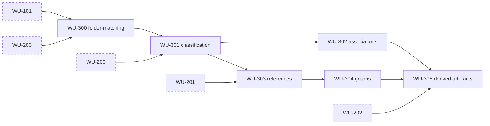

**M3 acceptance criteria**
- [ ] Hand-authored AppSpecs for every test app produce effective models and derived artefacts that match committed golden files.
- [ ] Two consecutive runs produce byte-identical derived artefacts.
- [ ] Ambiguous equal-rank folder matches, `idRef` alias cycles, root-escaping paths or reparse points, and classification ties are each reported with a distinct `TLR3xxx` code.
- [ ] The cyclic-plugin test app yields an error that lists the full cycle path. The one-way plugin chain passes.
- [ ] Every file in every test app has exactly one primary classification (coverage test).

### M4 Analysis & Validation → **v0.1.0-preview** (`analyse`, `validate`, `inspect`)

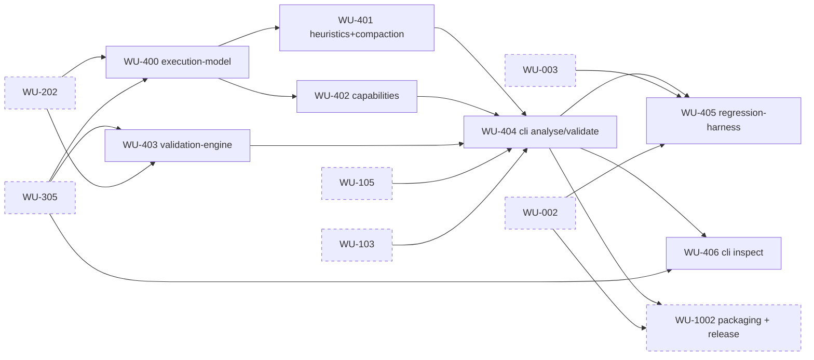

**M4 acceptance criteria**
- [ ] `analyse` → `validate` completes with zero errors across the entire test matrix, excluding fixtures flagged `expectedInvalid` in the test-app manifest (e.g. the cyclic plugin app), which produce exactly their expected diagnostics.
- [ ] The draft AppSpec uses `idRef`, recursion and a catch-all (no per-file enumeration for regular layouts) and carries confidence annotations ([AS §9.4](../Requirements/Application_Specification.md)).
- [ ] Edited-spec scenarios (wrong role, missing required association, wrong reference root, removed file, added file) are each detected by `validate` with the expected code and exit code 1.
- [ ] `analyse` leaves the input tree unchanged apart from sidecars (test-enforced). A read-only input requires `--spec-out`.
- [ ] The validation report contains the spec hash, tree fingerprint and state.
- [ ] `inspect` shows every derived artefact and graph (text and JSON), including `--plugin` scoping (WU-406).
- [ ] `dotnet pack` produces `dotnet-tailor`, which installs with `dotnet tool install --add-source` and runs (WU-404 local smoke). The tag-triggered release workflow publishes v0.1.0-preview (WU-1002).

### M5 Transformation Planning & Dry-run

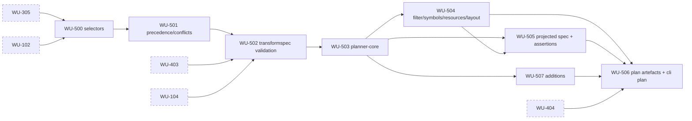

**M5 acceptance criteria**
- [ ] `plan` and `apply --dry-run` make zero filesystem mutations outside `--artefacts` and the NuGet package cache (the cache only when not `--offline`) (test-enforced with before and after tree snapshots).
- [ ] Equal-precedence conflicts, output collisions, unsafe removals and failed input assertions are detected as errors ([TS §22](../Requirements/Transformation_Specification.md), [TS §20.3](../Requirements/Transformation_Specification.md), [TS §6.4](../Requirements/Transformation_Specification.md)).
- [ ] The plan records every action with phase, provenance and order. Two runs produce byte-identical plans.
- [ ] The projected AppSpec validates against the output assertions for the filtering, symbols, docs and resources scenarios.
- [ ] User-provided file additions ([TS §19](../Requirements/Transformation_Specification.md)) land at deterministic destinations with provenance; collisions are errors (WU-507).

### M6 Execution Engine → **v0.2.0-preview**

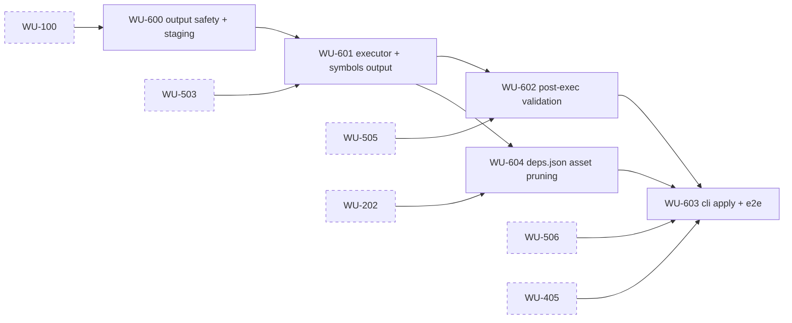

**M6 acceptance criteria**
- [ ] `apply` with filtering, symbols (directory and zip) and resource policies produces outputs that launch (console smoke run exits 0) and whose output AppSpec validates. Removed satellite, RID-specific and library assets are pruned from `*.deps.json` (WU-604).
- [ ] Input = output, nested, junction-aliased and non-empty output paths are rejected before any write, with exit code 1.
- [ ] Injected failures (executor fault, failed output assertion) leave no output directory and no staging remnants, with exit code 5. Cancellation leaves none either, with exit code 130.
- [ ] The symbols zip is byte-identical across two runs.

### M7 Acquisition & ReadyToRun → **v0.3.0-preview**

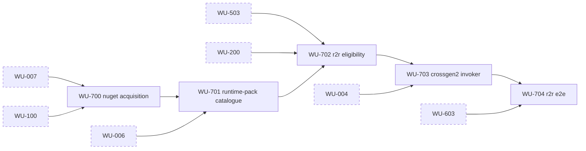

**M7 acceptance criteria**
- [ ] R2R-selected assemblies are detected as R2R in the output by the inspector. Skipped and ineligible assemblies each carry a reason in the plan (already R2R, runtime-pack framework assembly, not selected, mixed-mode, reference assembly, satellite resource, composite component).
- [ ] Output file hashes are equal across two runs (R2R determinism).
- [ ] Acquired packages are recorded with id, version, source and sha512. `--offline` with an empty cache fails with exit code 4.
- [ ] net8 and net10 targets use the matching crossgen2 major version. R2R outputs of the matrix apps launch.

### M8 Deployment Model Conversion → **v0.4.0-preview**

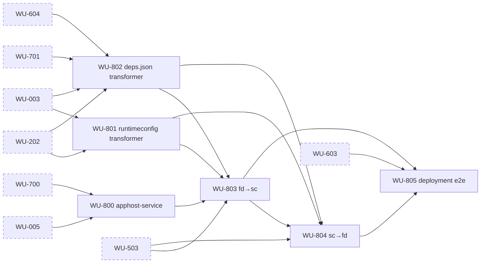

**M8 acceptance criteria**
- [ ] FD→SC and SC→FD for the console, WinForms and WPF test apps (net8 and net10) produce outputs that launch. The TransformSpec states the target runtime version or policy explicitly; omitting it fails validation.
- [ ] The converted runtimeconfig and deps.json are semantically equal to SDK-published equivalents under the normalisation documented in WU-805 (RID-specific package asset flattening, property ordering).
- [ ] The apphost retains its icon, version resources and GUI subsystem. A signed-input fixture produces the Authenticode warning.
- [ ] SC→FD removes only RuntimeList-catalogued files. App-owned native DLLs are preserved.

### M9 Retargeting & Patching → **v0.5.0-preview**

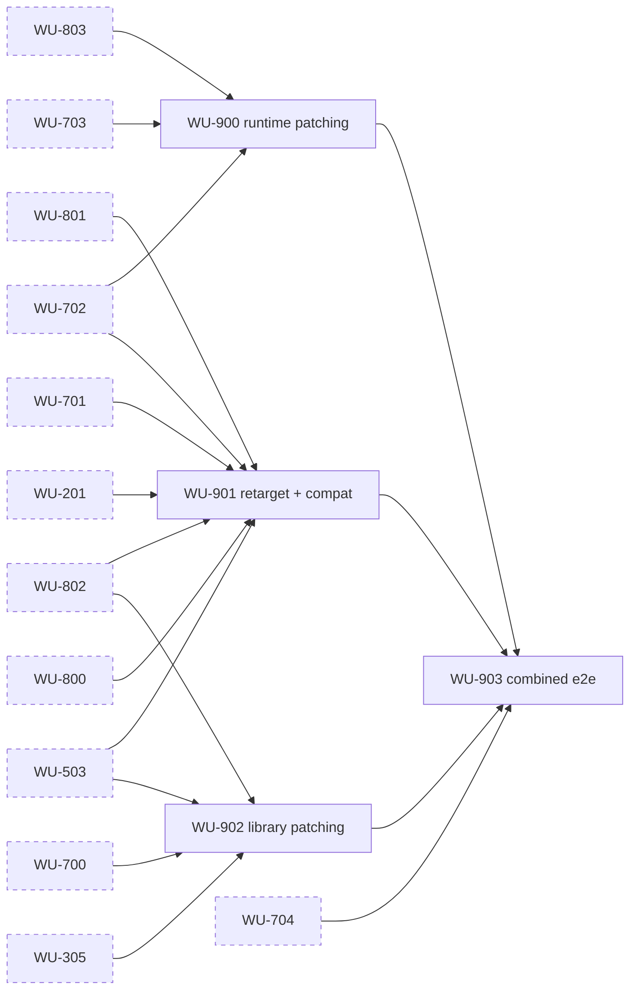

**M9 acceptance criteria**
- [ ] The [TS §33](../Requirements/Transformation_Specification.md) example runs end to end on the WPF plugin test app (net8 FD → net10 SC win-x64, latest patch pinned, selected library update, other-RID assets removed, `en`/`en-*` only, no XML docs, separate symbols, R2R except the excluded assembly). The output launches and all output assertions pass.
- [ ] A runtime patch (e.g. 8.0.13 → 8.0.25 SC) replaces exactly the RuntimeList diff and invalidates only affected R2R output.
- [ ] Retargeting an app that uses a removed API (BinaryFormatter fixture) fails planning with a compatibility diagnostic unless a compatibility policy allows it.
- [ ] No library changes version unless it is explicitly selected (test-enforced).

### M10 Configuration, Hardening & Release → **v1.0.0**

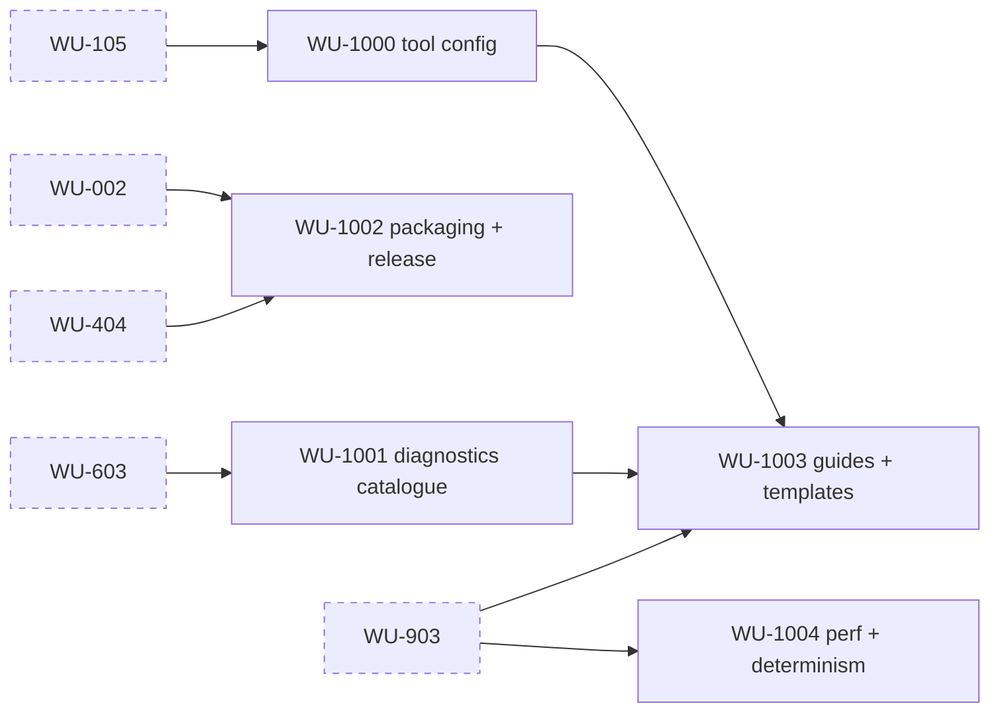

WU-1002 keeps its M10 ID and file but is **scheduled immediately after WU-404**; it enables v0.1.0-preview.

**M10 acceptance criteria**
- [ ] `dotnet-tailor.json` (repo and user), environment variables, response files and CLI merge with the documented precedence: CLI (response files inline) > environment > repo config (discovery stops at the git root) > user config > defaults (tested).
- [ ] Every emitted `TLR` code is documented in `Docs/Guides`. A test fails on any undocumented code.
- [ ] v1.0.0 is published through the tag-triggered release workflow. The package installs from the feed.
- [ ] User guides and the `enterprise-win-x64.transform.json` template are shipped. The template works against the matrix.
- [ ] Performance budget (defined in WU-1004) is met on a large synthetic tree. The full matrix passes the determinism check.

## Release Points

| Version | Milestone | Capability |
|---|---|---|
| v0.1.0-preview | M4 | `analyse`, `validate`, `inspect`, `schema export` |
| v0.2.0-preview | M6 | `plan`, `apply` (filtering, layout, symbols, docs, resources) |
| v0.3.0-preview | M7 | ReadyToRun |
| v0.4.0-preview | M8 | FD⇄SC |
| v0.5.0-preview | M9 | Retargeting, runtime and library patching |
| v1.0.0 | M10 | Config file, diagnostics catalogue, guides, hardening |

All releases use WU-1002's workflow, available immediately after WU-404.

## Critical Path

WU-000 → WU-100 → WU-101 → WU-300 → WU-301 → WU-303 → WU-304 → WU-305 → WU-500 → WU-501 → WU-502 → WU-503 → WU-504 → WU-505 → WU-506 → WU-603 → WU-704 → WU-903 → WU-1003.

## Risks Register

| ID | Risk | Impact | Mitigation | Owner WU |
|---|---|---|---|---|
| R1 | crossgen2 output is not deterministic | M7 criteria fail | Spike first. Fall back to semantic comparison and document it | WU-004 |
| R2 | Apphost placeholder format changes between runtime majors | FD⇄SC breaks | Per-major tests over the matrix. Fail with a clear diagnostic when the placeholder is not found | WU-005, WU-800 |
| R3 | Custom apphost patcher relies on undocumented internals | Maintainability | Isolate it in `Platform.Windows`. Confirm the decision (architecture §19 item 12) | WU-005 |
| R4 | RuntimeList variance across patches, WindowsDesktop `Profile` | Wrong file sets | Spike diff. Catalogue tests per version | WU-006, WU-701 |
| R5 | NuGet authentication and source mapping in CI | Acquisition failures | Honour the standard `nuget.config` hierarchy incl. `packageSourceCredentials` and credential providers. Test with a local feed | WU-007, WU-700 |
| R6 | Retarget breaking changes are not fully detectable | Runtime failures after retarget | MemberRef compatibility analysis plus an explicit policy. Document the limits | WU-901 |
| R7 | Test matrix CI time and size | Slow feedback | Cache keyed on the source hash. Tiered test runs (unit on PR, full matrix nightly if needed) | WU-002, WU-003 |
| R8 | JSON Schema validator licence | Legal blocker | Evaluate alternatives in the spike | WU-007 |
| R9 | Long paths, AV/Defender locks during atomic rename | Flaky apply | Retry rename with backoff. Long-path tests | WU-600 |
| R10 | Authenticode invalidation | Enterprise deployment rejected | Warning now. Decide on re-signing (open question) | WU-800 |
| R11 | Preview releases need WU-1002, which sits in M10 | Previews cannot be published | **Resolved**: WU-1002 is scheduled immediately after WU-404 (deps WU-002, WU-404); M4 pack/install criterion split into WU-404 local smoke + WU-1002 publishing | WU-1002 |
| R12 | Large trees (10k+ files) cause slow inspection | Usability | Parallel inspection with deterministic merge. Perf budget | WU-1004 |

## Open Questions — Awaiting User

Provisional defaults apply until the user decides.

| Question | Provisional default | Affected WUs |
|---|---|---|
| `knownUnresolved` references in the AppSpec (architecture §19 item 20) | Implement; mark dependent ACs `Blocked (#20)` if rejected | WU-101, WU-303, WU-401 |
| Own apphost patcher relying on the undocumented placeholder format (architecture §19 item 12) | Accept, isolated in `Platform.Windows`, per-major tests | WU-005, WU-800 |
| WCF / ASP.NET / AspNetCore runtime pack scope (architecture §19 item 15) | AspNetCore handled generically; test apps cover console/WinForms/WPF only | WU-003, WU-701, WU-803 |
| Authenticode re-signing | Warn only in v1 | WU-800, WU-805 |
| Whether `--output` may pre-exist (`--force`) | No: absent or empty only | WU-600, WU-603 |
| AppSpec format | JSON only | WU-101 |

Other open items owned by work units: JSON Schema validator library (WU-007); `$schema` URI hosting; `apply --plan` replay (not in v1).

## Resolved Decisions

Design decisions are recorded in [architecture §19](../Architecture/Tailor.architecture.md#19-resolved--open-inconsistencies); contract ownership is in [§3.2](../Architecture/Tailor.architecture.md#32-cross-layer-contracts), test rules in [Test Conventions](#test-conventions), and identity in [the naming plan](Tailor-naming.plan.md).

- Owners assigned: `inspect` (WU-406), `additions[]` (WU-507), minimal deps.json pruning for v0.2.0 (WU-604), shared deployment-model dispatcher and ConfigGeneration handler (WU-803).
